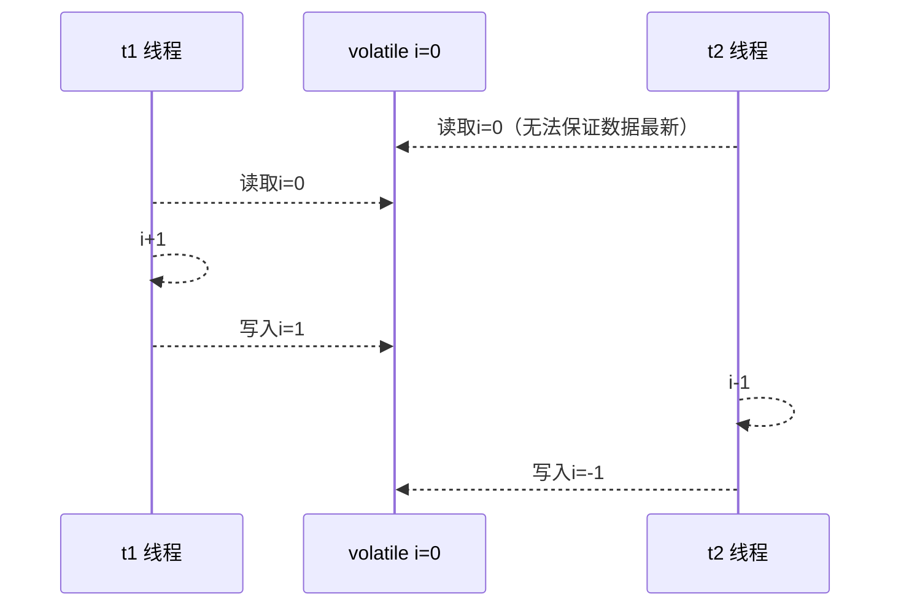

### 名词 

- Clock Cycle Time 主频的概念大家接触的比较多，而 CPU 的 Clock Cycle Time（时钟周期时间），等于主频的倒数，意思是 CPU 能 够识别的最小时间单位，比如说 4G 主频的 CPU 的 Clock Cycle Time 就是 0.25 ns，作为对比，我们墙上挂钟的 Cycle Time 是 1s 例如，运行一条加法指令一般需要一个时钟周期时间 
- CPI 有的指令需要更多的时钟周期时间，所以引出了 CPI （Cycles Per Instruction）指令平均时钟周期数 
- IPC IPC（Instruction Per Clock Cycle） 即 CPI 的倒数，表示每个时钟周期能够运行的指令数 CPU 执行时间 程序的
- CPU 执行时间，即我们前面提到的 user + system 时间，可以用下面的公式来表示

>程序 CPU 执行时间 = 指令数 * CPI * Clock Cycle Time

### 指令重排序优化

事实上，现代处理器会设计为一个时钟周期完成一条执行时间最长的 CPU 指令。为什么这么做呢？可以想到指令 还可以再划分成一个个更小的阶段，例如，每条指令都可以分为： 取指令 - 指令译码 - 执行指令 - 内存访问 - 数据 写回 这 5 个阶段


>- instruction fetch (IF) 
>- instruction decode (ID) 
>- execute (EX) 
>- memory access (MEM) 
>- register write back (WB)

在不改变程序结果的前提下，这些指令的各个阶段可以通过重排序和组合来实现指令级并行，指令重排的前提是，重排指令不能影响结果，李如意

```java
// 可以重排的例子
int a = 10; // 指令1
int b = 20; // 指令2
System.out.println( a + b );
// 不能重排的例子
int a = 10; // 指令1
int b = a - 5; // 指令2
```

### 支持流水线的处理器

现代 CPU 支持多级指令流水线，例如支持同时执行 取指令 - 指令译码 - 执行指令 - 内存访问 - 数据写回 的处理 器，就可以称之为五级指令流水线。这时 CPU 可以在一个时钟周期内，同时运行五条指令的不同阶段（相当于一 条执行时间最长的复杂指令），IPC = 1，本质上，流水线技术并不能缩短单条指令的执行时间，但它变相地提高了 指令地吞吐率。


可见性：

- 写屏障（sfence）保证在该屏障之前的，对共享变量的改动，都同步到主存当中
- 读屏障（lfence）保证在该屏障之后，对共享变量的读取，加载的是主存中的最新数据。

有序性：

- 写屏障会确保指令重排序时，不会讲些屏障之前的代码排在些屏障之后
- 读屏障会确保指令重排序时，不会将读屏障之后的代码排在读屏障之前。

### SuperScalar 处理器

大多数处理器包含多个执行单元，并不是所有计算功能都集中在一起，可以再细分为整数运算单元、浮点数运算单 元等，这样可以把多条指令也可以做到并行获取、译码等，CPU 可以在一个时钟周期内，执行多于一条指令，IPC > 1


### CPU缓存结构原理

#### CPU缓存结构


查看cpu缓存行

>root@yihang01 ~ cat /sys/devices/system/cpu/cpu0/cache/index0/coherency_line_size 
>
>64

cpu 拿到的内存地址格式是这样的

> [高位组标记] [低位索引] [偏移量]


#### CPU缓存读

读取数据流程如下 

- 根据低位，计算在缓存中的索引 
- 判断是否有效 
  - 0 去内存读取新数据更新缓存行 
  - 1 再对比高位组标记是否一致
    - 一致，根据偏移量返回缓存数据 
    - 不一致，去内存读取新数据更新缓存行

### 内存屏障

- 可见性 
  - 写屏障（sfence）保证在该屏障之前的，对共享变量的改动，都同步到主存当中 
  - 而读屏障（lfence）保证在该屏障之后，对共享变量的读取，加载的是主存中最新数据 
- 有序性
  - 写屏障会确保指令重排序时，不会将写屏障之前的代码排在写屏障之后 
  - 读屏障会确保指令重排序时，不会将读屏障之后的代码排在读屏障之前

### volatile原理

volatile 的底层实现原理是内存屏障，Memory Barrier（Memory Fence） 

- 对 volatile 变量的写指令后会加入写屏障 
- 对 volatile 变量的读指令前会加入读屏障

#### 如何保证可见性

- 写屏障保证在该屏障之前的，对共享变量的改动，都同步到主存中

- ```java
  int num = 0;
  boolean ready = false;
  public void actor2(I_Result r) {
   	num = 2;
   	ready = true; // ready 是 volatile 赋值带写屏障
   	// 写屏障
  }
  
  ```

- 而读屏障（lfence）保证在该屏障之后，对共享变量的读取，加载的是主存中最新数据

  

- ```java
  public void actor1(I_Result r) {
   	// 读屏障
   	// ready 是 volatile 读取值带读屏障
   	if(ready) {
   		r.r1 = num + num;
   	} else {
   		r.r1 = 1;
   	}
  }
  ```

  ```mermaid
  sequenceDiagram
  	participant t1 as t1 线程
  	participant num as num = 0
  	participant ready as volatile ready = false
  	participant t2 as t2 线程
  	t1-->>t1: num = 2
  	t1 ->>ready: ready = true
  	Note over t1, ready: 写屏障
  	Note over num, t2:读屏障
  	t2 ->>ready:读取ready=true
  	t2 ->>num: 读取num=2
  ```

根据之前的actor1，可能会有如下几种情况：

- 线程1限制性，这是ready = false，所以进入else，分支结果为1
- 线程2先只能num = 2，但还没来得及执行ready = true，线程1执行，还是进入else分支，结果为1
- 线程2执行到ready = true，线程1执行，这回进入if分支，结果为4，（num已经执行过了）
- 还有可能**是0**，线程2只能ready=true，切换到线程1，进入if分支，相加的0，再切回线程2执行，num = 2；

#### 保证有序性

还是那句话，不能解决指令交错：

- 写屏障仅仅是保证之后的读能够读到最新的结果，但不能保证读跑到它前面去 
- 而有序性的保证也只是保证了本线程内相关代码不被重排序

JIT及时编译器的优化无法预判。




写屏障会确保指令重排序时，不会将写屏障之前的代码排在写屏障之后

```java
int num;
volatile boolean ready;

public void actor2(Result r) {
    num = 2;
    ready = true; // ready 是volatile赋值带写屏障
    // 写屏障
}
```

读屏障会确保指令重排序时，不会将读屏障之后的代码排在读屏障之前

```java
public void actor1(Result r) {
    // 读屏障
    if (ready) {
        r.r1 = num + num;
    } else {
        r.r1 = 1;
    }
}
```

读写屏障只能保证可见性和有序性，不能解决指令交错的问题

- 写屏障仅仅是保证之后读能够读到最新的结果，但不能保证读跑到它前面去
- 而有序性的保证也只是保证了本线程内相关代码不被重排序

**synchronize可以保证不会发生有序性、可见性和原子性相关的问题，但是指令不一定会不重排序。**

**synchronized保证有序性、可见性和原子性的前提是在把对象完全交给同步代码块处理（即不能保证同步代码块之外的有序性问题），synchronized内部的重排序有可能会影响同步代码块外对相关对象的引用。**

**volatile保证了前两种**


## Double-checked locking

```java
public final class Singleton {
    private Singleton() {}
    private static Singleton INSTANCE = null;
    private static Singleton getInstance() {
        synchronized(Singleton.class) {
            if (INSTANCE == null) {
                INSTANCE = new Singleton();
            } 
            return INSTANCE;
        }
    }
}
```

以上实现的特点是：

- 懒惰实例化（在每次请求时再检查时再new一个新的singleton
- 问题是每次对类上锁消耗很大 等于对该类所有对象加锁
- 每次进入getInstance都需要上锁 开销很大
- 其实只要第一次进入时需要线程保护

```java
public final class Singleton {
    private Singleton() {}
    private static Singleton INSTANCE = null;
    private static Singleton getInstance() {
        if(INSTANCE == null) {
            synchronized(Singleton.class) {
            	if (INSTANCE == null) {
                	INSTANCE = new Singleton();
            	} 
        	}
        }
         return INSTANCE;
    }
}
```

- 首次使用getInstance()才使用synchronize，后续时无需打击所
- 有隐含的很关键的一个点：第一个if使用了INSTANCE变量，实在同步块外
- 但是仍有问题，因为第一个if在synchronize外面所有无法保证原子性和有序性，有可能发生指令重排。


17行表示创建对象，将对象引用入站

20 表示赋值一份对象引用

21表示利用一个对象引用，调用构造方法

24 表示利用一个对象引用，赋值给static INSTANCE

也许jvm会优化为先执行24，再执行21。


没有重排序的版本：

```java
public final class Singleton {
    private Singleton() {}
    private volatile static Singleton INSTANCE = null;
    private static Singleton getInstance() {
        if(INSTANCE == null) {
            synchronized(Singleton.class) {
            	if (INSTANCE == null) {
                	INSTANCE = new Singleton();
            	} 
        	}
        }
         return INSTANCE;
    }
}
```


从字节码上看不出来volatile指令的效果，但是volatile可以很好的解决指令重排序的问题。

如上面注释内容所示，读写volatile变相时会加入内存屏障，保证了：

- 可见性：
  - 写屏障（sfence）保证在该屏障之前对t1对共享变量的改动，都同步到主存当中
  - 而读屏障（lfence）保证在该屏障之后t2对共享变量的读取，加载的是主存中最新数据
- 有序性
  - 写屏障会确保指令重排序时，不会将写屏障之前的代码排在写屏障之后
  - 读屏障会确保指令重排序时，不会将读屏障之后的代码排在读屏障之前
- 更底层是读写变量时使用lock指令来多核CPU之间的可见性和有序性


## happens-before

happens-before规定了对共享变量的写操作对其他线程的读操作可见，它是可见性和有序性的一套规则总结，抛开一下happens-before规则，JMM并不能保证一个线程对共享变量的写，对于其他线程对该共享变量的读可见。

- 线程解锁m之前对变量的写，对于接下来m加锁的其他线程对该变量的读可见

  ```java
  static int x;
  static Object m = new Object();
  new Thread(() -> {
      synchronized(m) {
          x = 10;
      }
  }).start();
  new Thread(() -> {
      synchronized(m) {
          System.out.println(x);
      }
  }).start();
  ```

- 线程对volatile变量的写，对加下来其他线程对该变量的读可见

  ```java
  volatile static int x;
  new Thread(() -> {
      x = 10;
  }).start();
  
  new Thread(() -> {
      System.out.println(x);
  }).start();
  ```

- 线程start前对变量的写，对该线程开始后对该变量读可见。

  ```java
  static int x;
  x = 10;
  new Thread(() -> {
      System.out.println(x);
  }).start();
  ```

- 线程结束前对变量的写，对其他线程得知它结束后的读可见（比如其他线程调用t1.isAlive()或t1.join()等待它结束）

  ```java
  static int x;
  Thread t1 = new Thread(() -> {
      x = 10;
  });
  t1.start();
  t1.join();
  System.out.println(x);
  ```

- 线程t1打断t2（interrupt）前对变量的写，对于其他线程得知t2倍打断后对变量的度可见（通过t2.interrupted或t2.isInterrupted）

  ```java
  static int x;
  public static void main(String[] args) {
      Thread t2 = new Thread(() -> {
          while(true) {
              if (Thread.currentThread().isInterrupted()) {
                  System.out.println(x);
                  break;
              }
          }
      },"t2");
      t2.start();
      
      new Thread(() -> {
          sleep(1);
          x = 10;
          t2.interrupted();
      },"t1").start();
      
      while(!t2.isInterrupted()) {
          Thread.yield();
      }
      System.out.println(x);
  }
  ```

- 对变量默认值(0,false,null)的写，对其他线程对该变量的读可见。

- 具有传递性，如果x hb -> y并且y hb -> z，配合volatile的防指令重拍，有下面的例子

  ```java
  volatile static int x;
  static int y;
  new Thread(() -> {
      y = 10;
      x = 20;
  }, "t1").start();
  
  new Thread(() -> {
      // x=20对t2可见
      System.out.println(x);
  }, "t2").start();
  ```


## 线程安全单例练习

- 饿汉式：类加载就会导致该单例对象被创建
- 懒汉式：类加载不会导致该实例对象被创建，而是首次使用该对象时才会创建

```java
// 问题1：为什么加final
// 怕子类中不适当覆盖了单例，修改了父类
// 问题2：如果实现了序列化接口，还需要作者什么来防止反序列化破坏单例
// 使用readResolve
public final class Singleton implements Serializable {
    // 问题3：为什么要设置成私有？是否能防止反射创建新的示例？
    // 不能。反射
    private Singleton() {}
    // 问题4：这样初始化是否能保证单例对象创建时线程安全？
    private static final Singleton INSTANCE = new Singleton();
    //
    public static Singleton getInstance() {
        return INSTANCE;
    }
    
    // 这里可以保护反序列化的时候不会从字节码生成对象 而是直接从readResolve里返回结果
    public Object readResolve() {
        return INSTANCE;
    }
}
```


### 懒汉式单例 

实现2：

```java
// 不会被反射或者反序列化破坏单例
enum Singleton {
    INSTANCE;
}
```

实现3：

```java
public final class Singleton {
    private Singleton() {}
    private static Singleton INSTANCE = null;
    public static synchronized Singleton getInstance() {
        if (INSTANCE != null) {
            return INSTANCE;
        }
            INSTANCE = new Singleton();
            return INSTANCE;
    }
}
```

实现4：

```java
public final class Singleton {
    private Singleton() {}
    // 问题1： 解释为什么要加volatile
    private static volatile Singleton INSTANCE = null;
    // 问题2： 对比实现3，这样的意义是什么？
    // 这样的好处是在将来单例创建之后，每次检查不用再上锁，效率更高
    public static Singleton getInstance() {
        if (INSTANCE != null) {
            return INSTANCE;
        }
        synchronized (Singleton.class) {
            // 问题3： 为什么还要在这里加空判断，之前不是判断过了吗？
            // 这就是为了首次多线程来创建instance的时候的安全性
            if (INSTANCE != null) {
                return INSTANCE;
            }
            INSTANCE = new Singleton();
            return INSTANCE;
        }
    }
}
```

实现5：

```java
public final class Singleton {
    private Singleton() {}
    private static class LazyHolder {
        static final Singleton INSTANCE = new Singleton();
    }
    public static Singleton getInstance() {
        return LayzyHolder.INSTANCE;
    }
}
```


## 无锁实现

### CAS 无锁设计的关键

对于balance这样的变量，比起重型锁，可以使用AtomicInteger。

```java
public void withdraw(Integer amount) {
    while(true) {
        int prev = balance.get();
        int next = prev - amount;
        
        //比较并设置值
        if (blance.compareAndSet(prev, next)) break;
    }
}
```

CAS操作必须是原子的。CAS特点：

结合CAS和volatile可以实现无锁并发，适用于线程数少，多核CPU的场景下。

- CAS是基于乐观锁的思想：最乐观的估计，不怕别的线程来修改共享变量，就算改了也没关系，我点再重试呗。
- synchronized是基于悲观锁的实现：最悲观的估计，得防着其他线程来修改共享变相，我上了锁你们都别想改，我改完了解开锁，你们猜有机会。
- CAS体现的是**无锁并发，无阻塞并发**
  - 因为没有使用到synchronized，所以线程不会陷入阻塞，这是效率提升的因素之一。
  - 但如果竞争激烈，可以想到重试必然频繁发生，反而效率会受影响。

### AtomicInteger

``` java
public static void main(String[] args) {
    AtomicInteger i = new AtomicInteger(5);
    updateAndGet(i, p->p/2);
}

public static void updateAndGet(AtomicInteger i, IntUnaryOperator operator) {
    while(true) {
        int prev = i.get();
        int next = operator.applyAsInt(prev);
        if (i.compareAndSet(prev, next)) {
            break;
        }
    }
}
```

### 原子引用

- AtomicReference
- AtomicMarkableReference
- AtomicStampedRefence

BigDecimal Balance

```java
class DecimalAccount implements DecimalAccount {
    private AtomicReference<BigDecimal> balance;
    
    @Override
    public void withdraw(BigDecimal amount) {
        while(true) {
            BigDecimal prev = balance.get();
            BigDecimal next = prev.substarct(amount);
        }
    }
}
```

#### ABA问题

主线程无法感知到其他线程对原子引用的修改。

AtomicStampedReference可以加入版本号来判断是否被更改过。

```java
static AtomicStampedReference<String> ref = new AtomicStampedReference<>("A", 0);
String prev = ref.getReference();
// 获取版本号
int stamp = ref.getStamp();

// 修改value
ref.compareAndSet(prev,"C",stamp, stamp+ 1);

```

检查reference和版本号，解决ABA问题。

但是有时候，我们并不关心引用变量更改了几次，而只是想要知道有没有被更改过。（不再需要版本号，只要一个布尔值。）

```java
GarbageBag bag = new GarbageBag("full of garbage.")
    AtomicMarkableReference<GarbageBag> ref = new AtomicMakableReference<>(bag, true);

GarbageBag prev = ref.getReference();
boolean success = ref.compareAndSet(prev, new GarbageBag("empty bag"), true, false);
```

### 原子数组

有些时候，我们要改的并不是一个引用地址，而是这个引用对象本身。

- AtomicIntegerArray
- AtomicLongArray
- AtomicReferenceArray

```
函数式接口：
Supplier 提供者，无中生有  () -> 结果
Function 函数 一个参数一个结果 (参数) -> 结果，
         BiFunction (参数，参数) -> 结果
consumer 消费者 一个参数，没结果  (参数) —> void
         BiConsumer (参数, 参数) —> void
```

### 字段更新器

- AtomicReferenceFieldUpdater // 域，字段
- AtomicIntegerFieldUpdater
- AtomicLongFieldUpdater

```java
public static void main(String[] args) {
    Student stu = new Student();
    AtomicReferenceFieldUpdater updater = AtomicReferenceFieldUpdater.newUpdater(Student.class, String.class, "name");
    updater.compareAndSet(stu, null, "张三");
    System.out.println(stu);
}
```

### 原子累加器

```java
for(int i = 0; i < 5; i++ ) {

    demo(
            ()->new AtomicLong(0),
            (adder) -> adder.getAndIncrement()
    );
}
System.out.println("============================");
for(int i = 0; i < 5; i++ ) {
    demo(
            ()->new LongAdder(),
            (adder) -> adder.increment()
    );
}
```

累加器性能比较好。


**性能提升的原因：**

就是在有竞争的时候，设置多个累加单元，Thread-0累加Cell[0]，而Thread-1累加Cell[1].. 最后再将结果汇总。因此**减少了CAS重试失败**，从而提高了性能。

#### LongAdder的几个关键域：

```java
// 累加单元数组，懒惰初始化
transient volatile Cell[] cells;

// 基础值，如果没有竞争，则用cas累加这个域
transient volatile long base;

// 在cells创建或扩容时，置为1，表示加锁。
transient volative int cellsBusy;

```

### 伪共享


缓存以缓存行为单位，每个缓存行对应着一块内存（8个bytes）。缓存的加入会造成数据副本的产生，即同一份数据会缓存在不同核心的缓存行中。CPU要保证数据的一致性，如果某个CPU核心更改了数据，其他CPU对应的整个缓存行必须失效。


@sun.misc.Contended用来解决这个问题，它的原理是在使用此注解的对象或字段的前后各增加128字节大小的padding，从而让CPU将对象预读至缓存时占用不同的缓存行，这样，不会造成对方缓存行的失效。

### LongAdder的设计


如果Cells已被创建但是没有新的Cell：


如果cells和cell都已经被创建了：

最后一句话是用来改变线程对应的cell


扩容逻辑：


最终结果通过sum算出。


### Unsafe

Unsafe对象提供了非常底层的，操作内存、线程的发放，**Unsafe对象不能直接调用，只能通过反射获得。**

Unsafe是一个final不能被继承的对象，里面有一个theUnsafe的成员变量。


