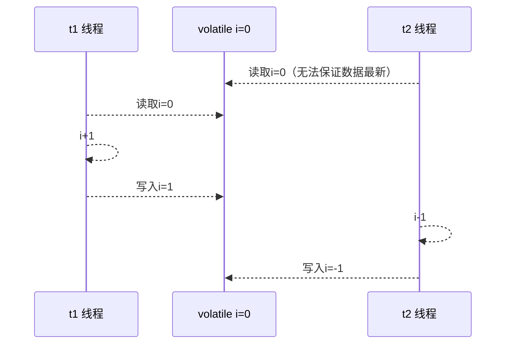

### java内存模型

JMM 即 Java Memory Model，它定义了主存、工作内存抽象概念，底层对应着 CPU 寄存器、缓存、硬件内存、 CPU 指令优化等。Java虚拟机规范中定义了Java内存模型（Java Memory Model，JMM），用于屏蔽掉各种硬件和操作系统的内存访问差异，以实现让Java程序在各种平台下都能达到一致的并发效果，JMM规范了Java虚拟机与计算机内存是如何协同工作的：规定了一个线程如何和何时可以看到由其他线程修改过后的共享变量的值，以及在必须时如何同步的访问共享变量。

Java内存模型（不仅仅是JVM内存分区）：调用栈和本地变量存放在线程栈上，对象存放在堆上。


- 一个本地变量可能是原始类型，在这种情况下，它总是“呆在”线程栈上。
- 一个本地变量也可能是指向一个对象的一个引用。在这种情况下，引用（这个本地变量）存放在线程栈上，但是对象本身存放在堆上。
- 一个对象可能包含方法，这些方法可能包含本地变量。这些本地变量仍然存放在线程栈上，即使这些方法所属的对象存放在堆上。
- 一个对象的成员变量可能随着这个对象自身存放在堆上。不管这个成员变量是原始类型还是引用类型。
- 静态成员变量跟随着类定义一起也存放在堆上。
- 存放在堆上的对象可以被所有持有对这个对象引用的线程访问。当一个线程可以访问一个对象时，它也可以访问这个对象的成员变量。如果两个线程同时调用同一个对象上的同一个方法，它们将会都访问这个对象的成员变量，但是每一个线程都拥有这个成员变量的私有拷贝。

 JMM 体现在以下几个方面 

- 原子性 - 保证指令不会受到线程上下文切换的影响 
- 可见性 - 保证指令不会受 cpu 缓存的影响 
- 有序性 - 保证指令不会受 cpu 指令并行优化的影响

[缓存模型](https://cloud.tencent.com/developer/article/1548942)

### MESI

[缓存一致性和读写屏障](https://zhuanlan.zhihu.com/p/43624414)

### 可见性

**退不出的循环**

先来看一个现象，main 线程对 run 变量的修改对于 t 线程不可见，导致了 t 线程无法停止：

```java
static boolean run = true;
public static void main(String[] args) throws InterruptedException {
 	Thread t = new Thread(()->{
 		while(run){
 		// ....
 		}
 	});
 	t.start();
 	sleep(1);
 	run = false; // 线程t不会如预想的停下来
}
```

为什么呢？分析一下：

1. 初始状态， t 线程刚开始从主内存读取了 run 的值到工作内存。


2. **. 因为 t 线程要频繁从主内存中读取 run 的值，JIT 编译器会将 run 的值缓存至自己工作内存中的高速缓存中， 减少对主存中 run 的访问，提高效率**

   

3. 1 秒之后，main 线程修改了 run 的值，并同步至主存，而 t 是从自己工作内存中的高速缓存中读取这个变量 的值，结果永远是旧值

   

#### 解决方法

volatile（易变关键字） 它可以用来修饰成员变量和静态成员变量，他可以避免线程从自己的工作缓存中查找变量的值，必须到主存中获取 它的值，线程操作 volatile 变量都是直接操作主存

#### 可见性 vs 原子性

前面例子体现的实际就是可见性，它保证的是在多个线程之间，一个线程对 volatile 变量的修改对另一个线程可 见， 不能保证原子性，仅用在一个写线程，多个读线程的情况： 上例从字节码理解是这样的：

```java
getstatic run // 线程 t 获取 run true
getstatic run // 线程 t 获取 run true
getstatic run // 线程 t 获取 run true
getstatic run // 线程 t 获取 run true
putstatic run // 线程 main 修改 run 为 false， 仅此一次
getstatic run // 线程 t 获取 run false 
```

比较一下之前我们将线程安全时举的例子：两个线程一个 i++ 一个 i-- ，只能保证看到最新值，**不能解决指令交错**

```java
// 假设i的初始值为0
getstatic i // 线程2-获取静态变量i的值 线程内i=0
    
getstatic i // 线程1-获取静态变量i的值 线程内i=0
iconst_1 // 线程1-准备常量1
iadd // 线程1-自增 线程内i=1
putstatic i // 线程1-将修改后的值存入静态变量i 静态变量i=1

iconst_1 // 线程2-准备常量1
isub // 线程2-自减 线程内i=-1
putstatic i // 线程2-将修改后的值存入静态变量i 静态变量i=-1 
```

>注意 synchronized 语句块既可以保证代码块的原子性，也同时保证代码块内变量的可见性。但缺点是 synchronized 是属于重量级操作，性能相对更低 
>
>如果在前面示例的死循环中加入 System.out.println() 会发现即使不加 volatile 修饰符，线程 t 也能正确看到 对 run 变量的修改了，为什么？

```java
 public void println(String x) {
	    synchronized (this) {
	        print(x);
	        newLine();
	    }
 }
```

原因是println有一个上锁的操作，synchronized保证了可见性。

### 有序性

```java
static int i;
static int j;
// 在某个线程内执行如下赋值操作
i = ...;
j = ...; 
```

可以看到，至于是先执行 i 还是 先执行 j ，对最终的结果不会产生影响。所以，上面代码真正执行时，既可以是

```java
i = ...;
j = ...;
```

也可以是

```java
j = ...;
i = ...; 
```

### 指令重排序

事实上，现代处理器会设计为一个时钟周期完成一条执行时间最长的 CPU 指令。为什么这么做呢？可以想到指令 还可以再划分成一个个更小的阶段，例如，每条指令都可以分为： 取指令 - 指令译码 - 执行指令 - 内存访问 - 数据 写回 这 5 个阶段


>- instruction fetch (IF) 
>- instruction decode (ID) 
>- execute (EX) 
>- memory access (MEM) 
>- register write back (WB)

在不改变程序结果的前提下，这些指令的各个阶段可以通过重排序和组合来实现指令级并行，指令重排的前提是，重排指令不能影响结果，李如意

```java
// 可以重排的例子
int a = 10; // 指令1
int b = 20; // 指令2
System.out.println( a + b );
// 不能重排的例子
int a = 10; // 指令1
int b = a - 5; // 指令2
```

#### 支持流水线的处理器

现代 CPU 支持多级指令流水线，例如支持同时执行 取指令 - 指令译码 - 执行指令 - 内存访问 - 数据写回 的处理 器，就可以称之为五级指令流水线。这时 CPU 可以在一个时钟周期内，同时运行五条指令的不同阶段（相当于一 条执行时间最长的复杂指令），IPC = 1，本质上，流水线技术并不能缩短单条指令的执行时间，但它变相地提高了 指令地吞吐率。


可见性：

- 写屏障（sfence）保证在该屏障之前的，对共享变量的改动，都同步到主存当中
- 读屏障（lfence）保证在该屏障之后，对共享变量的读取，加载的是主存中的最新数据。

有序性：

- 写屏障会确保指令重排序时，不会讲些屏障之前的代码排在些屏障之后
- 读屏障会确保指令重排序时，不会将读屏障之后的代码排在读屏障之前。

#### 问题

```java
int num = 0;
boolean ready = false;

//线程1执行
public void actor1(I_Result r) {
    if (ready) {
        r.r1 = num + num;
    } else {
        r.r1 = 1;
    }
}

// 线程2执行
public void actor2(I_Result r) {
    num = 2;
    ready = true
}
```

I_Result 是一个对象，有一个属性 r1 用来保存结果，一共有可能出现如下的情况：

- 线程1 先执行，这时 ready = false，所以进入 else 分支结果为 1
- 线程2 先执行 num = 2，但没来得及执行 ready = true，线程1 执行，还是进入 else 分支，结果为1
- 线程2 执行到 ready = true，线程1 执行，这回进入 if 分支，结果为 4（因为 num 已经执行过了）
- 线程2 执行 ready = true，切换到线程1，进入 if 分支，相加为 0，再切回线程2 执行 num = 2

这种现象叫做指令重排，是 JIT 编译器在运行时的一些优化，这个现象需要通过大量测试才能复现： 借助 java 并发压测工具 [jcstress](https://wiki.openjdk.java.net/display/CodeTools/jcstress)


### volatile原理

volatile 的底层实现原理是内存屏障，Memory Barrier（Memory Fence） 

- 对 volatile 变量的写指令后会加入写屏障 
- 对 volatile 变量的读指令前会加入读屏障

#### 如何保证可见性

- 写屏障保证在该屏障之前的，对共享变量的改动，都同步到主存中 **包括了num**

- ```java
  int num = 0;
  boolean ready = false;
  public void actor2(I_Result r) {
   	num = 2;
   	ready = true; // ready 是 volatile 赋值带写屏障
   	// 写屏障
  }
  
  ```

- 而读屏障（lfence）保证在该屏障之后，对共享变量的读取，加载的是主存中最新数据 **包括了num**

- ```java
  public void actor1(I_Result r) {
   	// 读屏障
   	// ready 是 volatile 读取值带读屏障
   	if(ready) {
   		r.r1 = num + num;
   	} else {
   		r.r1 = 1;
   	}
  }
  ```

  ```mermaid
  sequenceDiagram
  	participant t1 as t1 线程
  	participant num as num = 0
  	participant ready as volatile ready = false
  	participant t2 as t2 线程
  	t1-->>t1: num = 2
  	t1 ->>ready: ready = true
  	Note over t1, ready: 写屏障
  	Note over num, t2:读屏障
  	t2 ->>ready:读取ready=true
  	t2 ->>num: 读取num=2
  ```

根据之前的actor1，可能会有如下几种情况：

- 线程1限制性，这是ready = false，所以进入else，分支结果为1
- 线程2先只能num = 2，但还没来得及执行ready = true，线程1执行，还是进入else分支，结果为1
- 线程2执行到ready = true，线程1执行，这回进入if分支，结果为4，（num已经执行过了）
- 还有可能**是0**，线程2只能ready=true，切换到线程1，进入if分支，相加的0，再切回线程2执行，num = 2；

#### 保证有序性

还是那句话，不能解决指令交错：

- 写屏障仅仅是保证之后的读能够读到最新的结果，但不能保证读跑到它前面去 
- 而有序性的保证也只是保证了本线程内相关代码不被重排序

JIT及时编译器的优化无法预判。



### happens-before

happens-before 规定了对共享变量的写操作对其它线程的读操作可见，它是可见性与有序性的一套规则总结，抛 开以下 happens-before 规则，JMM 并不能保证一个线程对共享变量的写，对于其它线程对该共享变量的读可见

- 线程解锁 m 之前对变量的写，对于接下来对 m 加锁的其它线程对该变量的读可见

  ```java
  static int x;
  static Object m = new Object();
  new Thread(()->{
   	synchronized(m) {
   		x = 10;
       }
  },"t1").start();
  new Thread(()->{
   	synchronized(m) {
   		System.out.println(x);
   	}
  },"t2").start();
  ```

  

- 线程对 volatile 变量的写，对接下来其它线程对该变量的读可见

  ```java
  volatile static int x;
  new Thread(()->{
   	x = 10;
  },"t1").start();
  new Thread(()->{
   	System.out.println(x);
  },"t2").start();
  ```

  

- 线程 start 前对变量的写，对该线程开始后对该变量的读可见

  ```java
  static int x;
  x = 10;
  new Thread(()->{
   	System.out.println(x);
  },"t2").start();
  ```

  

- 线程结束前对变量的写，对其它线程得知它结束后的读可见（比如其它线程调用 t1.isAlive() 或 t1.join()等待 它结束）

  ```java
  static int x;
  Thread t1 = new Thread(()->{
   	x = 10;
  },"t1");
  t1.start();
  t1.join();
  System.out.println(x);
  ```

  

- 线程 t1 打断 t2（interrupt）前对变量的写，对于其他线程得知 t2 被打断后对变量的读可见（通过 t2.interrupted 或 t2.isInterrupted）

  ```java
  static int x;
  public static void main(String[] args) {
   	Thread t2 = new Thread(()->{
   		while(true) {
   			if(Thread.currentThread().isInterrupted()) {
   				System.out.println(x);
   				break;
   			}
   		}
   	},"t2");
   	t2.start();
   	new Thread(()->{
   		sleep(1);
   		x = 10;
   		t2.interrupt();
   	},"t1").start();
   	while(!t2.isInterrupted()) {
   		Thread.yield();
   	}
   	System.out.println(x);
  }
  
  ```

- 对变量默认值（0，false，null）的写，对其它线程对该变量的读可见

- 具有传递性，如果 x hb-> y 并且 y hb-> z 那么有 x hb-> z ，配合 volatile 的防指令重排，有下面的例子

  ```java
  volatile static int x;
  static int y;
  new Thread(()->{
   	y = 10;
   	x = 20;
  },"t1").start();
  new Thread(()->{
   	// x=20 对 t2 可见, 同时 y=10 也对 t2 可见
   	System.out.println(x);
  },"t2").start();
  
  ```

  ### Practice

  单例模式有很多实现方法，饿汉、懒汉、静态内部类、枚举类，试分析每种实现下获取单例对象（即调用 getInstance）时的线程安全，并思考注释中的问题

  >饿汉式：类加载就会导致该单实例对象被创建 
  >
  >懒汉式：类加载不会导致该单实例对象被创建，而是首次使用该对象时才会创建

  #### 实现1

  ```java
  // 问题1：为什么加 final
  // 问题2：如果实现了序列化接口, 还要做什么来防止反序列化破坏单例
  public final class Singleton implements Serializable {
   // 问题3：为什么设置为私有? 是否能防止反射创建新的实例?
   private Singleton() {}
   // 问题4：这样初始化是否能保证单例对象创建时的线程安全?
   private static final Singleton INSTANCE = new Singleton();
   public static Singleton getInstance() {
   return INSTANCE;
   }
   public Object readResolve() {
   return INSTANCE;
   }
  }
  ```

  问题1：怕子类覆盖

  问题2：实现了序列化接口 ，将来反序列化的时候也会生成一个新的对象，readResolve()会被当成反序列化的结果

  问题3：必须私有才能防止别人来使用构造器。不能防止反射

  问题4：没有线程安全问题，它是在类加载阶段赋值是安全的

  #### 实现2

  ```java
  // 问题1：枚举单例是如何限制实例个数的
  // 问题2：枚举单例在创建时是否有并发问题
  // 问题3：枚举单例能否被反射破坏单例
  // 问题4：枚举单例能否被反序列化破坏单例
  // 问题5：枚举单例属于懒汉式还是饿汉式
  // 问题6：枚举单例如果希望加入一些单例创建时的初始化逻辑该如何做
  enum Singleton {
   INSTANCE;
  }
  ```

  

  问题1：反编译之后发现是final 并且静态的

  问题2：类加载阶段完成，创建时是线程安全的

  问题3：不能用反射

  问题4：枚举已经防止了反序列化的发生

  问题5：饿汉式

  问题6：使用构造函数

  #### 实现3

  ```java
  public final class Singleton {
   	private Singleton() { }
   	private static Singleton INSTANCE = null;
   	// 分析这里的线程安全, 并说明有什么缺点
      // 锁的范围有点大
   	public static synchronized Singleton getInstance() {
   		if( INSTANCE != null ){
   			return INSTANCE;
   		}
   		INSTANCE = new Singleton();
   		return INSTANCE;
   	}
  }
  ```

  #### 实现4：DCL

  ```java
  public final class Singleton {
   private Singleton() { }
   // 问题1：解释为什么要加 volatile ?
   private static volatile Singleton INSTANCE = null;
   // 问题2：对比实现3, 说出这样做的意义 不用再上锁了
   public static Singleton getInstance() {
   	if (INSTANCE != null) {
   		return INSTANCE;
   	}
   	synchronized (Singleton.class) {
   		// 问题3：为什么还要在这里加为空判断, 之前不是判断过了吗
   		if (INSTANCE != null) { // t2
   			return INSTANCE;
   		}
   		INSTANCE = new Singleton();
   		return INSTANCE;
   	}
   }
  }
  ```

  