# 操作系统

## 基本概念

### 线程和进程

- 进程是资源分配的最小单位，一个线程有自己独立的内存分配空间。
- 线程是CPU调度的最小单位

### 并发、并行、同步、异步

- 并发：看似同时发生，微观上是短时间的切换任务。单核cpu只存在并发。

- 并行：完全同时发生。发生在多核cpu上。

### 共享：资源共享。

- 同时共享：系统中某些资源，虽然可以提供给多个进程使用，但一个时间段内只允许一个进程访问。例子：QQ和微信同时发送文件，对文件的读取可以是交替进行的。（这里的同时与并发一样，在微观上仍是交替）
- 互斥共享：允许一个时间段内多个进程“同时”进行访问。QQ在使用摄像头时，微信不能再使用资源。

如果失去并发性，系统只有一个程序在运行，则共享失去存在的意义。

如果失去共享性，则QQ和微信不能同时访问硬盘资源，就无法实现同时发送文件，无法并发。

### 虚拟

虚拟是把一个物理上的实体变为若干个逻辑上的对应物。**没有并发性，就谈不上虚拟性。**

### 异步

在多道程序环境下，允许多个程序并发执行，但由于资源有限，进程的执行不是一贯到底的，而是走走停停，以不可预知的速度向前推进，这就是进程的异步性。

### 内核程序vs应用程序

应用程序：跑在操作系统之上。QQ\微信

内核程序：有一帮人负责实现操作系统，他们写的是“内核程序”由很多内核程序组成了“操作系统内核”(kenel)。**内核是操作系统最重要核心的部分，也是最接近硬件的部分。**甚至可以说，一个操作系统只要有内核就够了。

“特权指令”：只允许管理者使用——即操作系统内核来使用。

CPU有两种状态：内核态和用户态

- 处于内核态时，说明此时正在运行的是内核程序，此时可以执行特权指令。
- 处于用户态时，说明此时正在运行的是应用程序，此时只能执行非特权指令。
- CPU种有一个寄存器叫做*程序状态字寄存器(PSW)*，其中有个二进制位，1表示内核态，0表示用户态。
- 如果在用户态下有应用程序存在一条特权指令，CPU会发出中段信号，夺回CPU的控制权，进入内核态。处理完中断信号之后，再把CPU使用权交给别的应用程序。

### 中断和异常

中断的两种类型：

- 内中断(异常)：与当前指令有关，中断信号来自于CPU内部。黑客的应用程序要求执行一个特权指令，然而CPU处于用户态，CPU内部会发出中断信号。参数是非法的也会造成内中断：除数为0。
  - 陷阱、陷入(trap): 由指令引发，是应用程序故意引发的。
  - 故障(fault): 由错误条件引起，可能被内核程序修复。内核程序修复后悔把CPU使用权还给应用程序，让它继续执行下去。如：缺页故障。
  - 终止(abort): 由知名错误引起，内核程序无法修复该错误，因此一般不再将CPU的使用权还给引发终止的应用程序，而是直接终止该应用程序。如：整除数为0、非法使用特权指令。
- 外中断(中断)：与当前指令无关，中断信号来自于CPU外部。有些时候应用程序想请求操作系统内核的服务，此时会执行一条特殊的指令——陷入指令，指令会引发一个内部中断信号，然后CPU会转向执行中断信号相应的内核程序。(操作权主动还给CPU)。例子：
  - 时钟中断：时钟不见每个一个时间片，会给CPU发送一个时钟中断信号。**支持了并发，时间分片。**当应用程序1运行了50毫秒之后，时钟部件会发送一个中断指令，然后CPU进入内核态，开始运行处理中断信号的内核程序，然后将CPU的使用权交给应用程序2。
- 中断机制的基本原理：不同的中断信号，需要不同的中断处理程序来处理。当CPU检测到中断信号后， 会根据中断信号的类型去查询“中断向量表”，以此来找到相应的中断处理程序在内存中的存放位置。

### 系统调用

系统调用是操作系统提供给应用程序使用的接口。应用程序->C库函数->系统调用。例子：取绝对值不需要系统调用，打开一个新文件需要系统调用。

*为什么需要系统调用？* 如果word和WPS同时需要打印文件，然后CPU交替地读取资源给打印设备，那么打印出来的内容就会弄混了。所以由操作系统内核对共享资源进行统一的管理，并向上提供“系统调用”，用户进程想要使用打印机这种共享资源，只能通过系统调用向操作系统内核发出请求。内核会对各个请求进行协调处理。

**凡是与共享资源有关的操作(如储存分配、I/O操作、文件管理等)，都必须通过系统调用的方式向操作系统内核提出服务请求，由操作体统内核代为完成。**

系统调用过程：传参指令(传入寄存器，指明系统调用类型。eg.fork)->存入其他参数->陷入指令->引发内中断->CPU处理陷入指令程序(由陷入程序引发的内中断，让CPU进入内核态)->fork系统调用的处理程序

## 进程

程序：静态的，存放在磁盘里的可执行文件。

进程：动态的，是程序的一次执行过程。

如何区分：当进程被创建时，操作系统会为该进程分配一个唯一的不重复的PID。

**进程的实体由PCB、程序段(指令集合)、数据段组成。**

**进程是动态的，进程实体(某一时刻的快照)是静态的。**

### PCB **进程存在的唯一标志**

以下这些信息都被保存PCB这个数据结构里

- 进程描述信息。操作系统要记录PID、进程所属用户ID(UID) *让操作系统区分各个进程*
- 进程控制和管理信息。CPU、磁盘、网络流量使用情况，进程当前状态：就绪态/阻塞态/运行态
- 资源分配清单。正在使用哪些I/O设备、正在使用哪些文件、正在使用哪些内存区域。*用于实现操作系统对资源的管理*
- 记录进程的运行情况(CPU使用时间、磁盘使用情况、网络流量使用情况等) *用于实现操作系统对进程的控制和调度*
- 处理机相关信息。PSW、PC等等各种寄存器的值。**用于实现进程切换**

**进程是进程实体的运行过程，是系统进行资源分配和调度的一个独立单位。**PCB是进程存在的唯一标志。

调度：一个进程被调度，就是指操作系统决定让这个进程上CPU运行。

### 进程的状态与转换

可执行文件(硬盘)->内存(PCB、程序段、数据段)

进程正在被创建时，它的状态是*创建态*，操作系统位进程分配资源、初始化PCB。

当进程创建完成之后，进入*就绪态*，处于就绪态的进程已经具备运行条件，但由于没有空闲CPU，就暂时不能运行。

进程用“系统调用”的方式申请某种系统资源，或请求 等待某个事件发生，在运行过程中**主动**申请进入*阻塞态*。

如果一个进程此时在CPU上运行，那么这个进程处于*运行态*。CPU会执行该进程对应的程序(执行指令序列)

如果时间分片到，进程从运行态回到就绪态。

如果发生错误或运行结束，进程进入终止态，被撤回PCB。

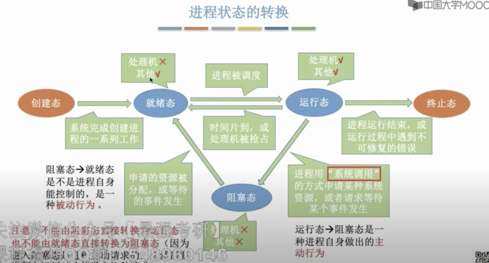

### 进程的组织

- 链式方式
  - 执行指针指向pcb
  - 就绪队列指针指向就绪态的进程，通常把优先级高的进程放在队头
  - 阻塞队列指针。
- 索引方式
  - 根据进程状态不同，建立几张索引表
  - 操作系统有指向各个索引表的指针

### 进程控制

控制进程的多种状态。

1. 更新PCB中的信息。
2. 将PCB插入合适的队列。
3. 分配/回收资源。

- 用"原语"实现，原语执行具有原子性，一气呵成。**原语一般是指由若干条指令组成的程序段，用来实现某个特定功能，在执行过程中不可被中断。是一种特殊的系统调用指令**

  - 创建原语：操作系统创建一个进程时使用的原语。申请空白PCB->为新锦成分配所需资源->初始化PCB->将PCB插入就绪队列。(引起创建的事件：用户登录等)
  - 撤销原语：从就绪/阻塞/运行某种状态进入终止态然后彻底消失。从PCB集合中找到进程PCB->剥夺CPU->终止所有的子进程->将资源归还给父进程或操作系统->删除PCB

  - 阻塞原语：找到要阻塞的进程对应的PCB->保护进程运行现场，将PCB状态信息设置为“阻塞态”，暂时停止进程运行->将PCB插入相应时间的等待队列。(引起阻塞的事件：需要等待系统分配某种资源或需要等待互相合作其他进程完成工作)
  - 唤醒原语：在时间等待队列中找到PCB->将PCB从等待队列移除，设置进程为就绪态->将PCB插入就绪队列，等待被调度。(引起唤醒的事件：等待的事件发生)
  - **因何事阻塞，就应由何事唤醒。**

- 保持原子性：隔离中断信号。(关中断指令和开中断指令，关中断指令之后，中断指令失效，特权指令)

- 进程的切换：

  切换原语：运行态->就绪态 and 就绪态->运行态

  在进程切换的时候，PCB保存寄存器中该进程使用的内容。**通过PCB恢复进程的运行环境**

### 进程通信

进程之间的信息交换，**各个进程拥有相互独立的内存地址。**一个进程不能直接访问另一个进程的地址空间。

每一个进程都有一个自己的地址空间，即进程空间或虚空间。

- 共享存储

  

  操作系统为两个线程分配共享空间。两个进程对共享空间的访问必须是互斥的。

  - 基于数据结构的共享，比如共享空间里只能放一个长度为10的数组。速度慢、限制多。
  - 基于储存区的共享，在内存中画出一块共享存储区，数据的形式、存放位置都由进程控制，而不是操作系统或。

- 消息传递

  进程之间的数据交换以格式化的消息(Message)为单位。进程通过操作系统提供的“发送消息/接受消息”两个原语进行数据交换。

  Message:

  1. 消息头：
  2. 消息体

  - 直接通信方式：消息直接挂在接受进程的消息缓冲队列上。

    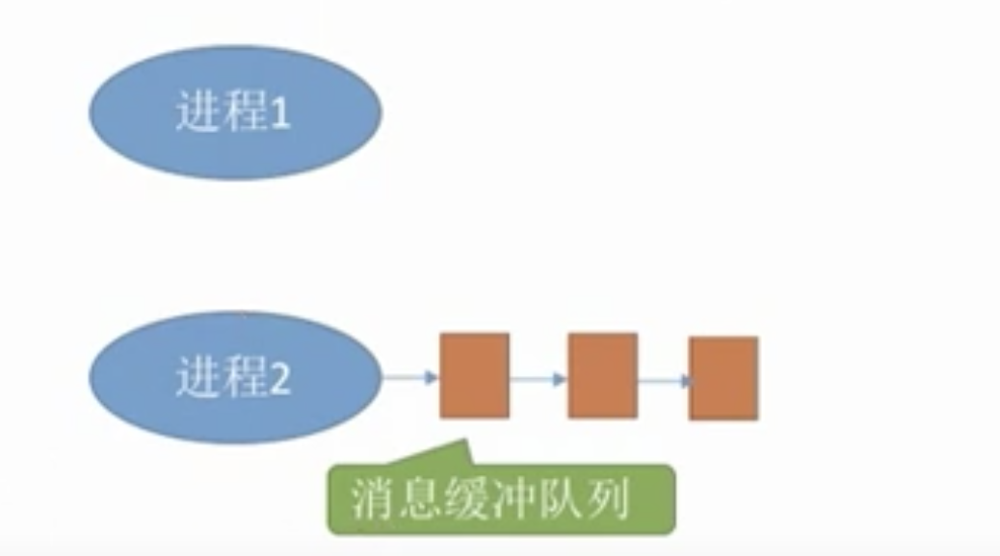

  - 间接通信方式：消息要先发送到中间实体(信箱)中。

    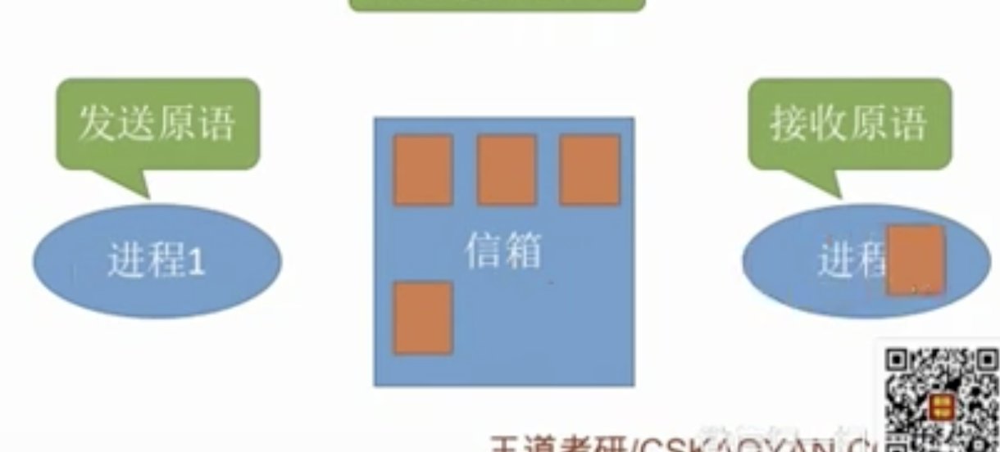

- 管道通信

  用于连接读写进程的一个共享文件，又名pipe文件。其实就是在内存中开辟一个大小固定的缓冲区。

  1. 管道只能采用半双工通信，某一时间段内只能实现单向的传输。如果要实现双向同事通信，需要设置两个管道
  2. 各进程要**互斥**地访问管道。
  3. 数据以字符流的形式写入管道，当管道写满时，写进程的write()系统调用将被阻塞。
  4. 进程1往管道内写满数据之后，进程2才能读。写满时，不能再写。读空时，不能再读。没写满不能读，没读空不能写。
  5. 管道中的数据一旦被读空之后就会被抛弃，意味着读进程只能有一个，否则会读错。

## 线程

背景：切换进程时，需要保存/回复进程运行环境，还需要切换内存地址空间(更新快表、更新缓存)开销很大。

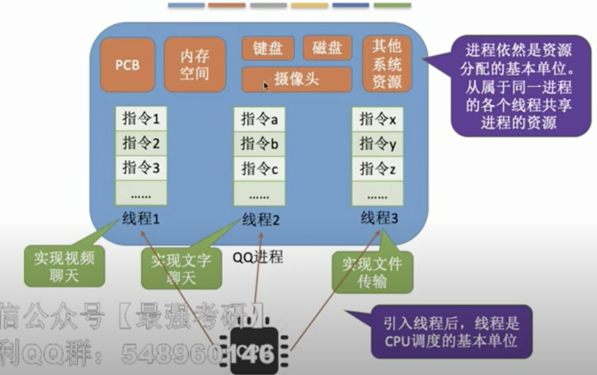

系统的并发性提升。**从属于不同进程的线程间切换，也会导致进程的切换，开销也很大。**

从属同意进程的各个线程共享进程拥有的资源。比较：

- 各个进程的内存空间相互独立，进程间通信必须请求操作系统服务(CPU要切换到核心态)，开销大。
- 同进程下的线程间共享内存地址空间，可以直接通过读/写内存空间通信，无需操作系统干预，开销更小。

**线程也有运行态、就绪态、阻塞态。**

### 多线程模型

- 用户级线程：早起操作系统，只支持进程。用户使用线程库来完成。操作系统无法意识到线程存在。

  - 优点：切换线程在用户态下完成，无需操作系统干预，开销小。

  - 缺点：如果其中某一行代码被阻塞，整个进程被阻塞。无法轮转调度。

- 内核级线程：操作系统来完成，线程切换需要CPU用户态进入内核态。操作系统需要为每个内核级线程建立相应的TCB(Thread Control Block)

  - 优点：当一个线程被阻塞后，别的线程还可以继续执行，并发能力强。多线程可以在多核处理机上并行执行。
  - 缺点：一个用户进程会占用多个内核级线程，线程切换由操作系统完成，开销大。

- 一对一模型：一个用户级线程映射到一个内核级线程。每个用户进程有与用户级线程同数量的内核级线程。
  - 优点：一个线程被阻塞后，别的线程还可以继续执行，并发能力强。
  - 缺点：一个用户进程会占用多个内核级线程，切换内核态开销大。
- 多对一模型：多个用户级线程映射到一个内核级线程。且一个进程只被分配一个内核级线程。
  - 优点：用户级线程的切换在用户空间就可以完成，不需要变态，线程管理的系统开销小，效率高。
  - 当一个用户级线程诶阻塞后，整个进程都会被阻塞，并发度不高。多个线程不可以在多核处理机上并行运行。

**内核级线程再试处理机分配的单位。用户级线程是“代码逻辑“的载体。内核级线程是”运行机会“的载体。**

- 多对多模型: n用户及线程映射到m个内核级线程(n>=m)。每个用户进程对应m个内核级线程。
  - 例子：QQ视频聊天、文字聊天、文件传输三种用户级线程。视频聊天占用CPU资源较大的时候可以让它对应一个内核级线程，文字聊天和文件传输对应一个内核级线程。如果文件传输占用资源较大时，可以将文字聊天的代码逻辑映射到视频聊天的内核级线程。

## 处理机的调度

按照一定的算法选择一个进程并将处理机分配给它运行。

### 调度的三个层次

- 高级调度: **外存与内存之间的调度**。面向作业

  按照一定的原则在处于后背队列的作业中挑选一个(或多个)作业，给他们分配内存等必要资源，并建立相应的PCB。只有建立了PCB之后，使进程获得进程处理机的权利。调入一次，调出一次。其主要任务是按照某种算法从外存的后备队列上选择一个或多个作业调入内存，并为其创建进程、分配必要的资源，然后再将所创建的进程控制块插入就绪队列中。

- 中级调度：将暂时不能运行的进程调至外存等待。等它重新具备了运行条件且内存又稍有空闲时，再重新调入内存。提高内存利用率和系统吞吐量。

  暂时被调到外存等待的进程状态为挂起状态。PCB常驻内存，PCB中会记录进程数据在外存中的存放位置，进程状态等信息，操作系统通过内存中的PCB来保持对各个进程的监控管理。被挂起的进程会被放倒挂起队列中。

  - 补充：进程的挂起状态和七状态模型

    暂时调到外村等待的进程状态为挂起状态 suspend

    就绪态->就绪挂起

    阻塞态->阻塞挂起

    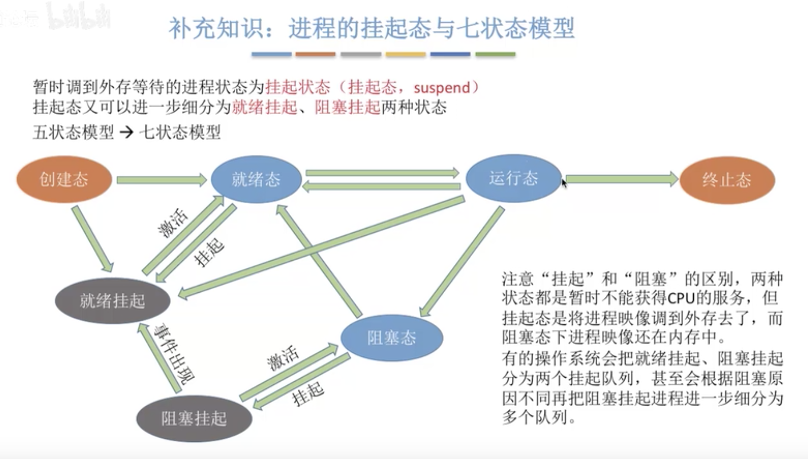

- 低级调度：**主要任务是按照某种方法和策略从就绪队列中选取一个进程，将处理机分配给它。**

  进程调度是操作系统中最基本的一种调度，在一般的操作系统中都必须配置进程调度。

### 进程调度的时机

进程调度(低级调度)，就是按照某种算法从就绪队列中选择一个进程为其分配处理机。

需要进行进程调度与切换的情况：

- 当前运行的进程主动放弃处理机：
  - 进程正常终止
  - 运行中发生异常
  - 进程主动请求阻塞（等待I/O）
- 被动放弃处理机
  - 分给进程的时间片用完
  - 有更紧急的事需要处理（I/O中断）
  - 有更高优先级的进程进入就绪队列

不能进行进程调度与切换的情况：

- 在处理中断的过程中。中断处理过程复杂，与硬件密切相关，很难做到在中断处理过程中进程进程切换。
- 进程在操作系统内核程序临界区中。
- 在原子操作过程中（原语）。远在操作不可中断，要一气呵成（修改pcb中进程状态标志，并把PCB放到相应队列里）

操作系统内核程序临界区 vs 普通临界区

临界资源：一个时间段内只允许以个进程使用的资源。各进程需要互斥地访问临界资源。（就绪队列）

临界区：访问临界资源的那段代码。

内核程序临界区一般用来访问某种内核数据结构的（就绪队列：由各个就绪进程的PCB组成）。

e.g 如果有一个进程正在访问就绪队列，就会给就绪队列上锁。在释放之前无法被调度或切换。

e.g 如果是像打印机这样的慢速设备，如果不能被调度或切换的话，就会导致CPU一直空闲。这样处于普通临界区的资源应该允许被调度或切换。

### 进程调度的方式

- 非剥夺调度方式，非抢占方式。只允许进程主动放弃处理机。在运行过程中即便有更紧迫的任务到达，当前进程依然会继续使用处理机，直到进程中止或主动要求进入阻塞态。

  实现简单，系统开销小但是无法及时处理紧急任务，适合于早起的批处理系统

- 剥夺调度方式，抢占方式，当一个进程正在处理机上执行时，如果有一个更重要或更紧迫的进程需要使用处理机，则立即暂停正在执行的进程，将处理机分配给更重要紧迫的那个进程。

  可以优先处理更紧急的进程。适合于分时操作系统、实时操作系统。

**进程切换的过程主要完成了**：

- 对原来运行进程各种数据的保存
- 对新的进程各种数据的回复（如：程序计数器、程序状态字、各种数据寄存器等处理机现场信息，这些信息一半会保存在进程控制块。）

### 调度算法的评价指标

- CPU利用率：CPU处于“忙碌”的时间占总时间的比利

  利用率=忙碌的时间/总时间

- 系统吞吐量：单位时间内完成作业的数量

  吞吐量=总共完成了多少道作业/总共花了多少时间

- 周转时间：作业提交给系统开始，到作业完成为止的这段时间间隔。它包括四个部分

  - 作业在外存后背队列上等待作业调度（高级调度）的时间、进程在就绪队列上等待进程调度（低级调度）的时间、进程在CPU上执行的时间、进程等待I/O操作完成的时间。后三项可能发生多次。
  - 周转时间=作业完成时间-作业提交时间
  - 带权周转时间(大于等于1)=作业周转时间/作业实际运行的时间 **两个时间都是越小越好**

- 等待时间：进程/作业处于等待处理机状态时间之和。

  - 对于进程来说，等待时间是指进程简历后等待被服务的时间之和，在等待I/O完成的期间其实进程也是在被服务的，所以不计入等待时间。
  - 对于作业来说，不仅要考虑建立进程后的等待时间，还要加上作业在外存后备队列中等待的时间。

- 响应时间：用户提交请求到首次产生响应所用的时间。

**调度算法只会影响作业/进程的等待时间**

### 调度算法

#### 先来先服务 FCFC

主要从“公平”的角度考虑（类似于排队买东西）。按照作业/进程到达的先后顺序进行服务。**非抢占式算法**。

对短作业有利，对长作业不利。

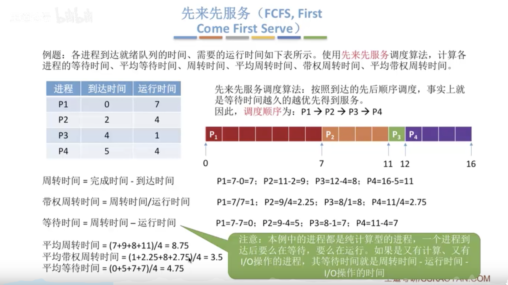

#### 短作业优先 JSF Shortest Job First

追求最少的平均等待时间，最少的平均周转时间，最少的平均带权周转时间。对于进程调度时称为”段进程优先 SPF Shortest Process First算法。

非抢占式的短作业优先算法：

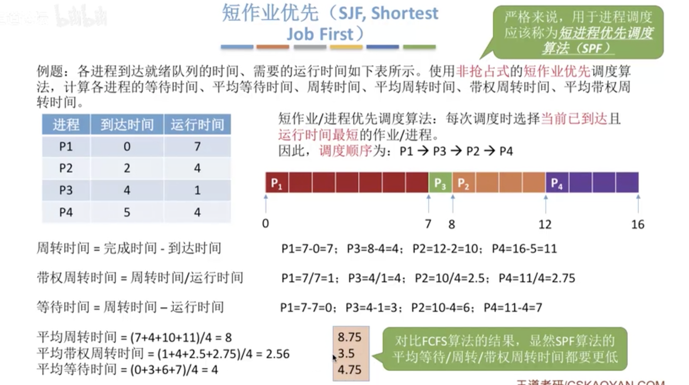

抢占式的短作业优先算法：最短剩余时间优先。

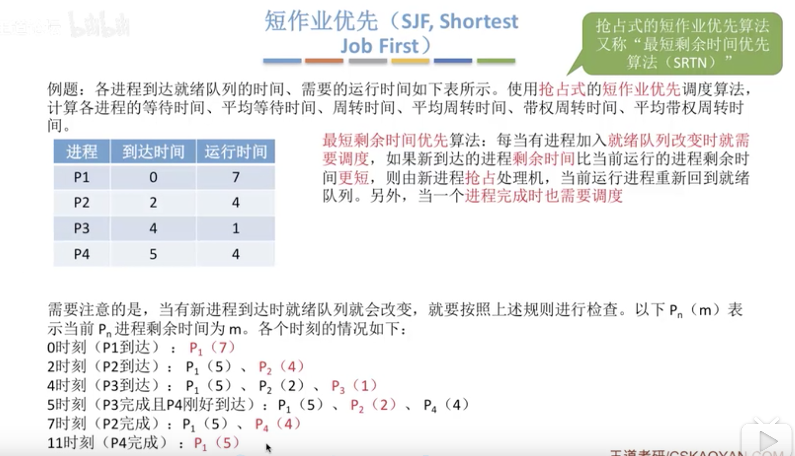

优点：“最短的”平均等待时间、平均周转时间。

缺点：不公平，对厂作业不利。会导致饥饿。另外，作业/进程的运行时间是由用户提供的，并不一定真是，不一定能做到真正的短作业优先。

#### 高响应比优先 HRRN Highest Response Ratio Next

综合考虑作业/进程的等待时间和要求服务时间。在每次调度时先计算各个作业/进程的响应比，选择响应比最高的作业/进程为其服务。**响应比=(等待时间+要求服务时间)/要求服务时间**(要求服务时间=运行时间)

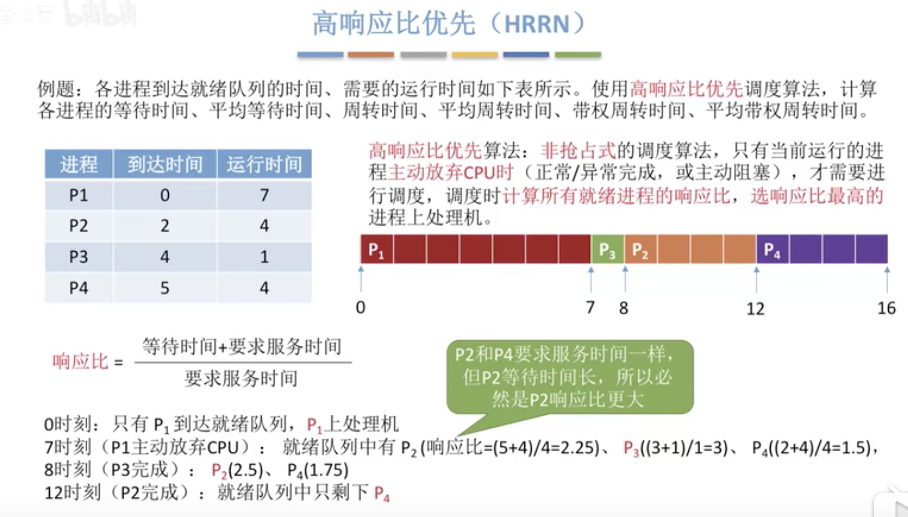

优点：

- 等待时间相同时，要求服务时间短的优先(SJF的优点)
- 要求服务时间相同时，等待时间长的优先(FCFS的优点)
- 对于厂作业来说，随着等待时间越来越久，其响应比也会越来越大，避免了厂作业饥饿问题。

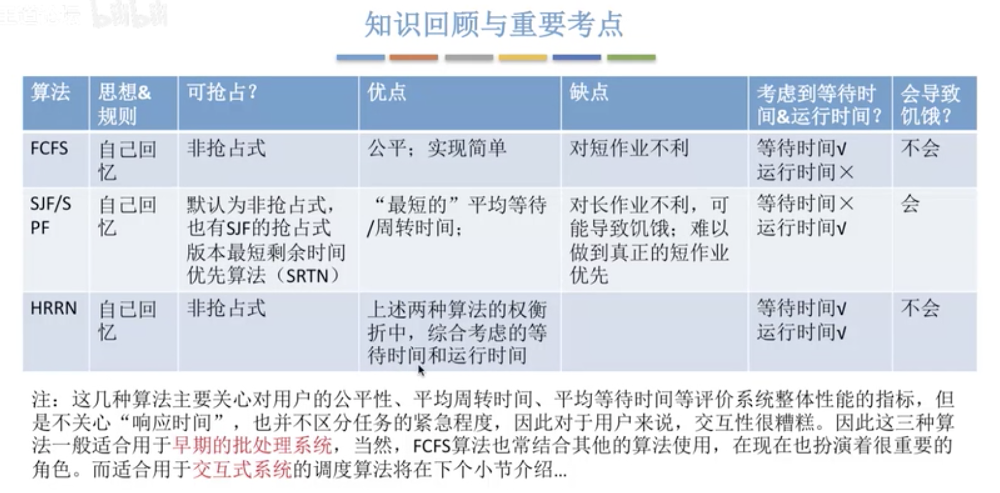

#### 时间片轮转 RR Round-Robin

公平地、轮流地位各个进程服务，让每一个进程在一定时间间隔内都可以得到相应。按照各进程到达的就绪队列的顺序，轮流让各个进程执行一个时间片。若进程未在一个时间片内执行完，则剥夺处理机，将进程重新放进就绪队列队尾重新排队。**抢占式算法**，由时钟装置发出的时钟中断来通知CPU时间片已到。

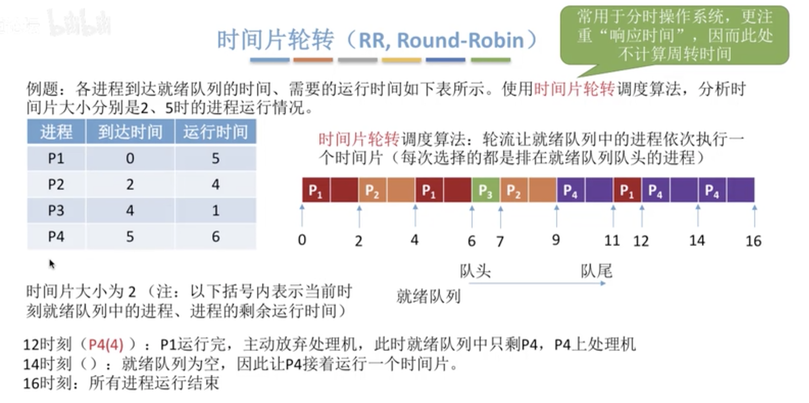

如果时间片太大，是的每个进程都可以在一个时间片内就能完成，则时间片轮转调度算法*退化*为先来先服务调度算法，并且会增大进程相应时间。

另一方面，进程调度、切换是有时间代价的（保存、恢复运行环境），如果时间片太小，会导致进程切换过誉频繁，系统会花大量的时间来处理进程切换，导致实际用于执行的时间比例减少。*一般来说，设计时间片时要让切换进程的开销占比不超过1%*

优点：公平、相应快，适用于分时操作系统。

缺点：进程切换有一定开销，不区分任务的紧急程度。

#### 优先级调度算法

随着计算机的发展，特别是实时OS的出现，很多应用场景需要根据任务的紧急程度来决定处理顺序。**调度时选择优先级最高的作业/进程**

- 抢占式：线程注定发起处理机时进行调度

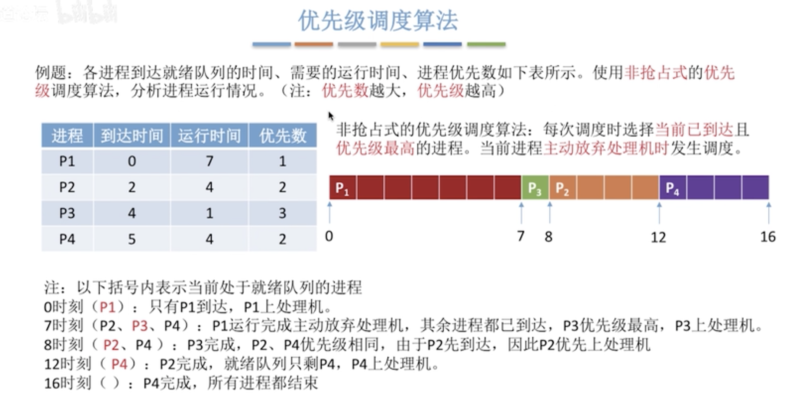

- 非抢占式：在就绪队列变化时，检查是否会发生抢占

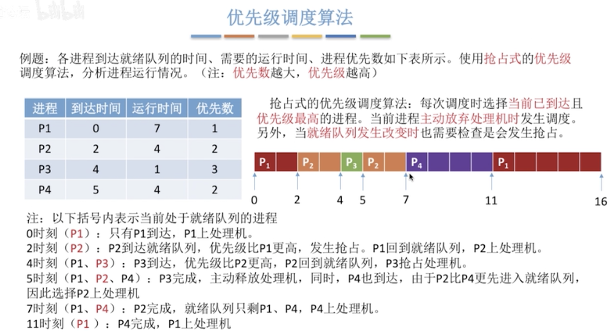

- 就绪队列未必只有一个，可以按照不通的优先级来组织另外，也可以把优先级更高的进程排在队头的位置。
  - 静态优先级：在创建进程时确定，之后一直不变
  - 动态优先级：创建进程时有一个初始值，之后会根基情况动态调整。
    - 如果进程在就绪队列中等待了很长时间，则可以适当提升其优先级。如果进程占用了处理机很长时间，则可适当降低其优先级。（高响应比优先算法）
    - 如果发现一个进程频繁进行I/O操作，则可以适当提升其优先级。
- 通常：
  - 系统进程优先级高于用户进程
  - 前台进程优先级高于后台进程
  - 操作系统更偏好I/O型进程（I/O繁忙型进程：I/O设备和CPU可以并行工作。如果优先让I/O满放行进程优先运行的话，则越有可能让I/O设备今早地投入工作，则效率提高）

优点：利用优先级区分紧急程度、重要程度，适用于实时操作系统，可灵活地调整对各种作业/进程的偏好程度。

缺点：若源源不断地有高邮寄进程到来，**则可能导致饥饿**。

#### 多级反馈队列算法

对其他调度算法的折中权衡

1. 设计多级就绪队列，**各级队列优先级从高到低，时间片从小到大**
2. 新进程到达时先进入第一级队列，按FCFS原则排队等待被分配时间片，若用完时间片进程还未结束，则进入下一级队列队尾。如果此时已经在**最下级队列**，则重新放回该队列队尾
3. 只有在k队列为**空**的时候，才会为k+1级队列分配时间片。
4. **抢占式**算法，在k级队列的进程运行过程中，若更上级的队列中进入新的进程，新进程抢占处理机，原来运行的进程放回k级队列队尾。

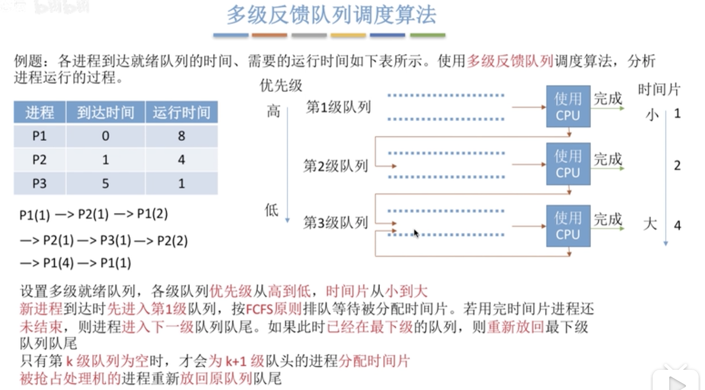

- P2在第二级队列运行时，P3进入第一级队列，P3**抢占**CPU，P2退出CPU运行，继续留在**第二级队列**

优点：

- 对各类型进程相对公平 FCFS的优点
- 每个新到达的进程都可以额很快得到相应 RR的优点
- 段进城只用较少的时间就可以完成 SPF的优点
- 不必实现估计进程的运行时间 避免用户作假
- 可灵活地调整对各类进程的偏好程度 优先级调度算法的有点，比如 可以将因I/O而阻塞的进程重新放回原队列，这样I/O型进程就可以保持比较高的优先级。

**会导致饥饿。**如果有源源不断的进程进来，就会在最高级队列被处理完。

## 进程之间的同步和互斥

### 进程同步

进程具有异步性的特征。异步性是指，各并发执行的进程以各自独立的、不可预知的速度向前推进。

例子：老渣约会。如果女1的指令是做他的初恋，而女2的要求是交往有恋爱经验的渣男。那么因为进程的异步性，有可能执行成功，也有可能执行失败。

例子：进程通信——管道通信。读进程和谢金成并发地运行，由于**并发必然导致异步性**，因为读和写两个操作执行先后顺序是不确定的。而实际应用中，又必须按照“写数据->读数据”的顺序来执行的，**如何解决这种异步问题，就是“进程同步”所导论的内容。**

#### 概念

同步亦称直接制约关系，它是指为完成某种任务而建立的两个或多个进程，这些进程因为需要再某些位置上协调它们的工作次而产生的制约关系。进程间的直接制约关系就是源于它们之间的互相合作。

### 进程互斥

两种资源共享方式：互斥共享、同时共享。

**临界资源**：一个时间段内只允许一个进程使用的资源(摄像头、打印机)。此外还有很多变量、数据、内存缓冲区等都属于临界资源。**对于临界资源的访问，必须互斥地进行**

#### 概念

互斥亦称间接制约关系。进程互斥指当一个进程访问某临界资源时，另一个想要访问该临界资源的进程必须等待。

对临界资源的互斥访问，可以在逻辑上分为四个部分：

~~~C
do {
		//进入区，负责检查可否进入临界区
		//若可以进入，则设置正在访问邻接资源的标志（上锁）
		//以阻止其他进程同事进入临界区。
		entry section;
		//访问临界资源的那段代码
		critical section; //临界区
		//负责解锁
		exit section; //退出区
		//做其他处理
		remainder section; //剩余区
} while(true)
~~~

为了实现对邻接资源的互斥访问，同事保证系统整体性能，需要遵循以下原则：

1. 空闲让进。临界区空闲，可以允许一个请求进入临界区的进程like进入。
2. 忙则等待。当已有进程进入临界区时，其他视图进入临界区的进程必须等待。
3. 有限等待。对请求访问的进程，应保证在有限时间内进入临界区（保证不会饥饿）
4. 让权等待。当进程不能进入临界区时，立即释放处理机，防止进程忙等待。

### 进程互斥的软件实现方法

#### 单标志法

两个进程在访问完临界区后悔把使用临界区的权限交给另一个进程。**也就是说每个进程进入临界区的权限只能被另一个进程赋予。**

用一个 turn 来表示当前允许进入临界区的进程号，通常，一个进程访问完临界区之后会把turn修改为其他的进程号，然后其他的进程号就可以进入临界区。但缺点是，如果一个进程一直不进入临界区也不修改turn的值，就违背了空闲让进的原则。

#### 双标志先检查法

设置一个布尔型的flag[]，数组中的各个元素用来标记各进程想进入临界区的意愿。**每个进程在进入临界区之前先检查当前有没有别的进程想进入，如果没有，则把自申对应的标志flag[i] = true，之后开始访问临界区。**

因为并发造成的异步性，所以在检查*是否别的进程想进入*的时候可能出现问题。有可能两个都进程都进入临界区。违反了”忙则等待“原则。**原因在于，进入区的检查和上锁两个处理不是一气呵成的。检查后，上锁前可能发生进程切换。**

#### 双标志后检查法

上一个算法的改版。**先上锁，后检查**

同样的问题，还是不能一气呵成。有可能P1进程上锁后，未检查，进程切换，P2上锁，检查发现无法进入临界区。**造成饥饿现象**，违背了空闲让进和有限等待的原则，可能造成各个进程都长期无法访问临界资源。

#### Peterson算法

如果两个进程都争着进入临界区，那可以让进程尝试“孔融让梨”。

~~~~C
bool flag[2];
int true = 0;
// P0 												//P1
flag[0]=true;									flag[1]=true;
turn = 1;											turn = 0;
while(flag[1]&&turn==1); 			while(flag[0]&&turn==0);
critical section;							critical section;
flag[0]=false;								flag[1]=false;
~~~~

该算法用软件方法解决了进程互斥的问题，遵循了前三个原则。但是违背了让权等待的原则。

### 进程互斥的硬件实现方法

#### 中断屏蔽方法

跟原语一样，利用“开/关中断指令”实现。在整个过程中不允许被中断，也就不能发生进程切换，因此也不可能发生两个同时访问临界区的情况。

优点：简单、高效

缺点：不适用于多处理机，只适用于操作系统内核进程，不适合于用户进程（因为开/关中断指令只能运行在内核态(特权指令)，这组指令如果能让用户随意使用会很危险）

#### TestAndSet指令

简称TS指令，也可称TestAndSetLock指令，TSL指令。TLS指令**是用硬件实现的**，执行的过程不允许被中断，只能一气呵成。

~~~C
bool TestAndSet (bool *lock) {
	bool old;
  old = *lock; //old用来存放之前lock的值
  *lock = true; //无论之前是否已枷锁，都将lock设为true
  return old; //返回lock原来的值
}
//使用TSL指令实现互斥的算法逻辑
while(TestAndSet(&lock)); //上锁并检查
临界区代码段..
lock = false; //解锁
~~~

用硬件的方法把上锁和检查操作变成了一气呵成的院子操作。

缺点：不满足让权等待。

#### Swap指令 (Exchange 指令，XCHG)

用硬件实现，执行中不允许被中断。

~~~C
void Swap(bool *a, bool *b) {
	bool temp;
	temp = *a;
	*a = *b;
	*b = temp;
}
while old = true;
while (old == true) Swap(&lock, &old);
临界区代码段..
lock = false
~~~

Swap和TSL很像，都是先记录下此时临界区是否已经被上锁（检查old），再将上锁标记lock设置为true，最后检查old，如果old为false则说明之前没有别的进程对临界区上锁。

缺点：不满足让权等待。

### 信号量机制

用户进程可以通过使用操作系统**一对原语**来对信号量进行操作，实现进程同步。

- wait(S)原语，P(S)
- signal(S)原语，V(S)

**信号量**其实就是一个变量，可以用一个信号量来表示系统中某种资源的数量，比如：系统中只有一台打印机，就可以设置一个初值为1的信号量。

- 整型信号量：表示系统中某种资源的数量。

  ~~~C
  int S = 1; //初始化整型信号量s，表示当前系统中可以用的打印机资源数

  //检查和上锁一气呵成
  //但是会造成忙等
  void wait(int S) {
    while (S<=0); //如果资源数不够，一直循环等待
    S=S-1; 				//如果资源数够，就占用一个资源
  }
  void signal(int S) {
    S = S+1; //使用完资源后，在退出区释放资源
  }
  进程P0：
    wait(S);		//进入区，申请资源
  	使用打印机资源... //临界区，访问资源
    signal(S);  //退出区，释放资源
  ~~~

- 记录型信号量

  ~~~C
  typedef struct {
    int value; 					//剩余资源数
    struct process *L;	//等待队列
  } semaphore;
  void wait (semaphore S) {
    S.value--;
    if (S.value < 0) block(S.L);
    // block原语：使进程从运行态进入阻塞态，并把它挂到信号量S的等到队列（阻塞队列）中
  }
  void signal(semaphore S) {
    s.value++;
    //当S.value小于0的时候，说明等待队列有进程在等待，如果大于0，就说明已经么有进程等待了。
    if (S.value <= 0) wakeup(S.L);
    //释放资源后，若还有别的进程在等待这种资源，则使用wakeup原语唤醒等待队列中的一个进程，该进程从阻塞态变成就绪态
  }
  ~~~

  对信号量S的一次P操作意味着进程请求一个单位的该类资源，因此需要执行S.value--，表示资源数减1，当S.value<-时表示该类资源已经分配完毕，因此进程调用block原语进行自我阻塞，主动放弃处理机。

  对信号量S的一次V操作意味着进程释放一个单位的该类资源，因此需要执行S.value++，表示资源数加1，若加1后仍是S.value<=0，表示依然有进程在等待该类资源，因此调用wakeup原语唤醒等待队列中的第一个进程。

### 信号量机制实现进程互斥、同步、前驱关系

#### 进程互斥

1. 分析并发进程的关键活动，划定临界区（特殊资源，只能分配给一个进程）
2. 设置互斥信号量mutex，初值为1
3. 在临界区之前执行P(mutex)
4. 在临界区之后执行V(mutex)

Note: 对不同的邻接资源需要设置不通的互斥信号量。

~~~C
mutex = 1
P1(){														P2(){
  P(mutex);														P(mutex);
  临界区;															临界区;
  V(mutex);														V(mutex);
}																}
~~~

#### 进程同步

1. 分析什么地方需要实现同步关系
2. 设置同步信号量S，初始值为1.
3. 在"前操作"之后执行V(S)
4. 在"后操作"之前执行P(S)

~~~C
semaphore S = 0;
P1(){														P2(){
  代码1;														P(S);
  代码2;														代码4;
  V(S);														  代码5：
  代码3;
}																}
~~~

若先执行V(S)操作，则S++后S=1，之后当执行到P(S)操作时，由于S=1，表示有可用资源，会执行S--，S的值变回0，P2进程不会执行block，会继续执行代码4。

若先执行到P(S), S--后S=-1，表示没有可用资源，P(S)会执行block，主动请求阻塞。之后当执行完代码2，继而执行V(S)操作，S++，此时S变回0，V操作中会执行wakeup原语，唤醒P2，然后P2继续执行代码4。

#### 前驱关系

1. 为每一对前驱关系各设置一个同步变量
2. 在前操作之后对对应的同步变量执行V操作
3. 在后操作之前对相应的同步变量执行P操作。

### 生产者-消费者问题

系统中有一组生产者进程和一组消费者进程，生产者进程每次生产一个产品放入缓冲区，消费者进程每次从缓冲区中取出一个产品并使用。（这里“产品”理解为某种数据）

- 只有缓冲区没满时，生产者才能把产品放入缓冲区，否则必须等待。
- 只有缓冲区不空时，消费者才能从中取出产品，否则必须等待。
- 缓冲区是临界资源，各进程必须互斥地访问。

~~~C
semaphore mutex = 1; //互斥信号量，实现对缓冲区的互斥访问
semaphore empty = n; //同步信号量，表示空闲缓冲区的数量
semaphore full = 0; //同步信号量，表示产品的数量，非空缓冲区的数量
producer() {										consumer(){
	while (1) {											while (1) {		
		生产一个产品;											P(full);
		P(empty);												P(mutex);
		P(mutex);												从缓冲区取出一个产品;
		把产品放入缓冲区；									V(mutex);
		V(mutex);												V(empty);
		V(full)													使用产品;
	}
}
// 互斥操作P和同步操作P不能被交换顺序
// 因为如果缓冲区已经放满了产品，则empty=0，full=n
// 生产者被阻塞之后，消费者也会被阻塞
// 出现死锁
// V操作的顺序是可以互换的
~~~

### 多生产者-多消费者模型

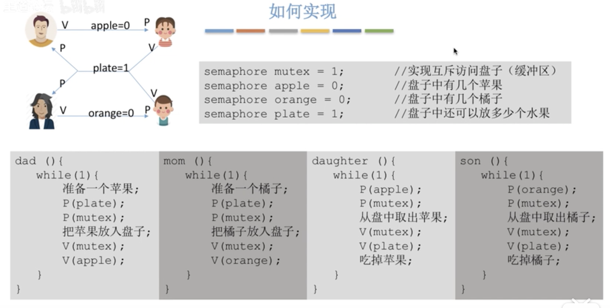

mutex可以不要吗，在这道题里可以不要，因为plate只有一个。如果缓冲区大于1，必须要设置互斥信号量mutex。

### 抽烟者问题

### 读者-写者问题

写者与写者之间互斥，写者与读者之间互斥，读者与读者不互斥。

注意：要对count访问上锁。

核心思想：设置了一个计数器count用来记录当前正在访问共享文件的进程数。我们可以用count的值来判断当前进入的进程是否是第一个/最后一个读进程，从而做出不同的处理。

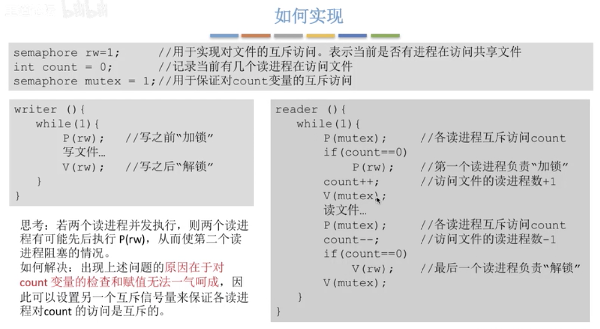

这样会导致写者进程饥饿，无法保证写者优先。

解决：在writer()的while loop里最外层分别加上P(w),V(w)，

### 哲学家问题

~~~C
semaphore chopstick[5] = {1,1,1,1,1};
semaphore mutex = 1;
Pi(){
  while(1) {
    P(mutex); //在拿筷子的时候保证是互斥的
    P(chopstick[i]);
    P(chopstick[i+1]);
    V(mutext);
    吃饭...
    V(chopstick[i]);
    V(chopstick[i+1]);
    思考...
  }
}
~~~

这种方式保证了即使一个哲学家在拿筷子拿到一半时被阻塞，也不会有别的哲学家会继续尝试拿筷子。这样的话，目前正在吃饭的哲学家放下筷子后，被阻塞的和雪茄就可以获得等待的筷子了。

### 管程

管程是一种特殊的软件模块，有这些部分组成：

1. 局部于管程的共享数据结构说明
2. 对该数据结构进行操作的一组函数
3. 对局部于管程的共享数据设置初始值语句
4. 管程有一个名字

管程的特征：

1. 局部于管程的数据只能被局部与管程的函数所访问
   2. 一个进程只有通过调用管程内的过程才能进入管程访问共享数据
3. 每次仅允许一个进程在管程内执行某个内部函数，**保证了进程间对共享资源访问的互斥**

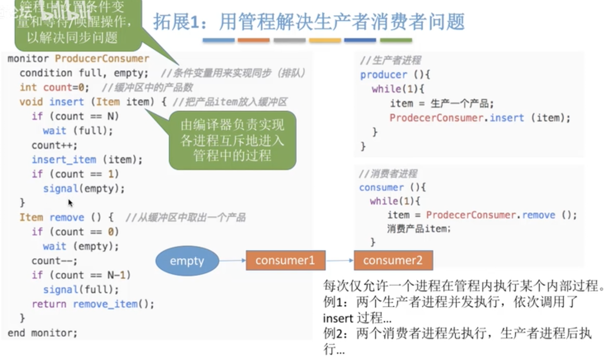

Java中使用syncronized来描述一个函数，那么这个函数同一时间段内只能被一个线程调用。

## 死锁

死锁：个进程互相等待对方手里的资源，导致各进程都阻塞，无法向前推进的现象。

饥饿：忧郁长期得不到想要的资源，某进程无法向前推进的现象。比如：段进城优先算法。

死循环：bug逻辑导致。

死锁产生的必要条件（只要一条不成立，死锁就不会发生）：

1. 互斥条件
2. 不可剥夺条件：进程所获得的的资源在未使用完之前，不能由其他进程强行夺走，只能主动释放
3. 请求和保持条件：进程已经保持了至少一个资源，但是又提出了新的资源请求，该资源又被其他进程战友，此时请求线程被阻塞，但又对自己已有的资源保持不放。
4. 循环等待条件：存在一种进程资源的循环等待链，链中的每一个进程已获得的资源同时被下一个进程所请求。

总之，对不可剥夺资源的不合理分配，可能导致死锁。

### 死锁的处理策略

### 预防死锁

**破坏四个必要条件中的一条**

1. 互斥条件。把只能互斥使用的资源改造成允许共享使用，则系统不会进入死锁状态。

   e.g SPOOLing技术，让请求打印的进程把请求发给一个输出进程保管，输出进程负责依次向打印机发送打印请求。而其他进程不必阻塞。

2. 不剥夺条件。

   1. 当某个进程请求信的资源得不到满足时，它必须立即释放保持的所有资源，待以后需要时再重新申请。缺点：需要全部放弃，如果一直保持目前的情况就有可能导致饥饿。释放已获得资源可能造成前一阶段的工作失效。
   2. 当某个进程需要的资源被其他进程所占有的时候，可以由操作系统协助，将想要的资源强行剥夺。缺点：

   缺点：实现起来复杂，反复地申请和释放资源会增加系统开销，降低系统吞吐量。

3. 请求和保持条件。

   - 采用静态分配方法，即进程在运行前一次申请完它所需要的全部资源，在它的资源未满足钱，不让它投入运行。一旦投入运行后，这些资源就一直归他所有，该进程就不会再请求别的任何资源。缺点：导致其他资源饥饿。

4. 循环等待条件。可采用顺序资源分配法。首先给系统的资源编号，规定各个进程必须按照编号递增的顺序请求资源，同类资源（编号相同的资源）一次申请完。

   一个进程只有已占有小编号的资源时，才有资格申请更大编号的资源。按此规则，已持有大编号资源的进程不可能逆向地回来申请小编号的资源，从而就不会产生循环等待的现象。

   缺点：1.不方便增加新的设备，因为可能需要重新分配所有编号；2.进程实际使用资源的顺序可能和编号递增顺序不一样，会导致资源浪费；3.必须按照规定次序申请资源，用户编程麻烦。

### 死锁的处理

#### 银行家算法

Dijkstra为银行系统设计，以确保银行在发放现金贷款时，不会发生不能满足所有客户需要的情况，后来算法被用在操作系统中，避免死锁。

安全序列，是指如果系统按照这种序列分配资源，则每个进程都能顺利完成。只要能找出一个安全序列，系统就是**安全状态**。如果分配了资源之后，系统中找不出任何一个安全序列，系统就进入了不安全状态。这就意味着之后可能所有进程都无法顺利的执行下去。

**如果系统处于安全状态，就一定不会发生死锁。**如果系统进入不安全状态，就可能发生死锁。

因此可以在资源分配之前预先判断这次分配是否会导致系统进入不安全状态，以此决定是否答应资源分配请求。

**核心思想**：在进程提出资源申请时，先预判此次分配是否会导致系统进入不安全状态。如果会进入不安全状态，就暂时不答应这请求，让该进程阻塞等待。

把单维的数字拓展为多维的向量。比如

| 进程 | 最大需求 | 已分配  | 最多还需要 |
| ---- | -------- | ------- | ---------- |
| P0   | (7,5,3)  | (0,1,0) | (7,4,3)    |
| P1   | (3,2,2)  | (2,0,0) | (1,2,2)    |
| P2   | (9,0,2)  | (2,0,0) | (6,0,0)    |
| P3   | (2,2,2)  | (2,1,1) | (0,1,1)    |
| P4   | (4,3,3)  | (0,0,2) | (4,3,1)    |

如果目前资源数还剩下(3,3,2)，首先发现可以满足P1的最大需求，把P1加入安全序列，并更新可用资源为(5,3,2)。然后继续检查，最后找出整个安全序列。

算法步骤：

1. 检查此次申请是否超过了之前声明的最大需求数
2. 检查此时系统圣墟的可用资源是否还能满足这次请求
3. 试探着分配，更改各数据结构
4. 用安全性算法检查此次分配是否会导致系统进入不安全状态
   1. 检查当前的剩余可用资源是否能满足某个进程的最大需求，如果可以，加入安全序列，并把该进程持有的资源回收。
   2. 循环，检查是否所有进程都可以加入安全序列。

### 死锁的检测和接触

#### 检测：

1. 用某种数据结构来保存资源的请求和分配信息。
   - 两种节点：
     - 进程节点：对应一个进程
     - 资源节点：对应一类资源，一类资源可能有多个
   - 两种边：
     - 请求边：指向资源节点，申请多少资源，一条边代表一个
     - 分配边：指向进程节点，分配了多少资源
2. 提供一种算法，利用上述信息来检测系统是否已经进入死锁。

#### 解除

1. 资源剥夺发。挂起某些死锁进程，并抢占它的资源。
2. 撤销进程法。
3. 进程回退法。让一个或多个死锁进程回退到足以避免死锁的地步。要求系统记录进程的历史信息。

## 内存

 ### 内存管理

1. 负责内存空间的分配与回收
2. 需要提供某种技术上从逻辑上对内存空间进程扩充
3. 需要提供地址转换功能，负责程序的逻辑地址与物理地址。

#### 地址转换

1. 绝对装入：编译时产生绝对地址
2. 可重定位装入：装入时将逻辑地址转换为物理地址
3. 动态运行时装入：运行时将逻辑地址转换为物理地址，需设置重定位寄存器。

#### 存储保护

#### 内存空间的扩充

1. 覆盖技术：将程序分为多个段，常用的段常驻内存，不常用的段在需要时调入内存。缺点：对用户不透明，增加了用户编程负担，需要显式地构建程序逻辑。

   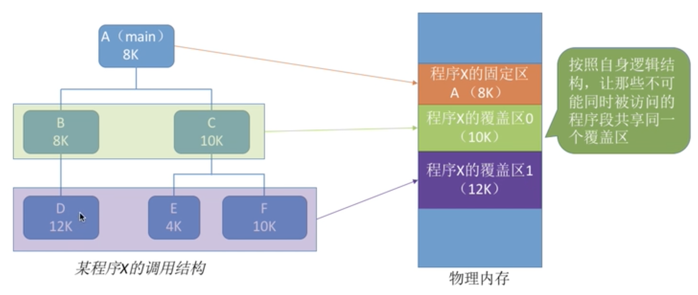

2. 交换技术：内存空间紧张时，系统将内存中某些进程暂时换出外存，把外存中某些已具备运行条件的进程换入内存（进程在内存与磁盘间动态调度）

   暂时换出外存等待的进程为挂起状态(挂起又分就绪挂起和阻塞挂起，取决于是由什么状态进入挂起的)。挂起对列会保存挂起进程的PCB，PCB中有挂起进程储存的外存位置。

   - 什么位置保存被换出的进程？具有对换功能的操作系统中，通常把磁盘空间分为文件区和对换区两部分。一般对换区蚕蛹连续分配方式，对换区的I/O速度比文件区的更快。
   - 应该换出哪些进程？可以优先换出阻塞进程：可换出优先级更低的进程；为了防止优先级低的进程在被调入内存后很快又换出，有的程序还会考虑进程在内存的驻留时间。

   **PCB常留内存**

#### 内存空间的分配与回收

##### 连续分配管理的方式

连续分配：指为用户进程分配的必须是要一个连续的内存空间

内部碎片，分配给某个进程的内存区域中，如果有些部分没有用上。

外部碎片，指内存中某些空闲分区由于太小而难以利用。是在进程调入调出的过程中遗留的。20MB链接这4MB，如果20MB出去，进来16MB的，在4MB之前就会留出一个6MB的碎片。

- 可以通过紧凑（compaction）技术来解决外部碎片。进程的起始地址被存在PCB里，重定位寄存器。

1. 单一连续分配：在单一连续分配方式中，内存被分为系统区和用户区，系统区通常位于内存的低地址部分，存放操作系统相关数据。用户区用于存放用户进程相关数据。只能有一道用户程序，用户程序独占整个用户区空间。

   优点：无外部碎片：可以采用覆盖技术扩充内存。缺点：有内部碎片，存储器利用率极低。

2. 固定分区分配：将整个用户空间划分为若干个固定大小的分区，在每个分区中只装入一道作业，这样就形成了最早的、最简单的一种可运行多道程序的内存管理方式。**可以将区分为不同大小**。

   操作系统需要建立一个分区说明表，实现各个分区的分配与回收。每列对应一个分区，通常按照分区大小排列。

   优点：实现简单，无外部碎片。缺点：a.如果程序太大，不得不使用覆盖技术。b. 会产生内部碎片。

3. 动态分区分配：可变分区分配。这种分配方式不会预先划分内存区，而是在进程装入内存时，根据进程的大小动态地寄哪里分区，并使分区的大小正好适合进程的需要。因此系统分区的大小和数目是可变的。

   - 操作系统要用什么样的数据结构记录内存使用情况？

     空闲分区表：每个空闲分区对应一列。

     | 分区号 | 分区大小(MB) | 起始地址(M) | 状态 |
     | ------ | ------------ | ----------- | ---- |
     | 1      | 20           | 8           | 空闲 |
     | 2      | 10           | 32          | 空闲 |

     空闲分区链：每个分区的起始部分和末尾部分分别设置指针指向上一个或下一个空闲分区。起始部分除还可以记录分区大小等信息。

     ~~~mermaid
     graph LR
     A(10 MB) --> B(20 MB)
     B --> C(4 MB)
     C --> B
     B --> A
     ~~~

   - 当很多空闲分区都能满足需求时，应该选择哪个分区进行分配？

     按照一定的动态分区的算法

   - 如何进行分区的分配与回收操作？

     一个4MB新进程出来

     | 分区号 | 分区大小(MB) | 起始地址(M) | 状态 |
     | ------ | ------------ | ----------- | ---- |
     | 1      | 16           | 12          | 空闲 |
     | 2      | 10           | 32          | 空闲 |

     回收：一个进程结束之后要把其使用的空间回收，更新到邻近的空闲分区里，如果前后都有空闲空间，**需要合并整个空间**。如果前后都没有空闲空间，增加一个空闲空间给表或链。

##### 动态分区分配算法

在动态分区分配方式中，当很多个空闲分区都能满足需求时，应该选择哪个分区进行分配？

- 首次适应算法：每次都从低地址开始查找，找到第一个能满足大小的空闲分区。

  空闲分区以地址递增的次序排列。每次分配时顺序查找空间分区链，找到大小能满足要求的第一个空闲分区。

- 最佳适应算法：由于动态分区分配时一种连续分配方式，为各进程分配的空间必须是连续的一整片区域。因此为了保证当“大进程”到来时能有连续的大片空间，可以尽可能多地留下大片的空闲区，即，优先使用更小的空闲区。

  空闲分区按容量递增次序链接。每次分配内存时顺序查找空闲分区链，找到大小能满足要求的第一个空闲分区。

  缺点：每次都选最小的分区进行分配，会留下越来越多的、很小的、难以利用的内存块。因此这种方法会产生很多外部碎片。

- 最坏适应算法：为了解决最佳适应算法的问题——留下太多难以利用的小碎片，可以在每次分配时优先使用最大的连续空闲区，这样分配后剩余的空闲区就不会太小。

  空闲分区按容量递减的次序链接。每次分配内存时顺序查找空闲分区链，找到大小能满足要求的第一个空闲分区。

  缺点：大分区会被用得越来越小，然后当大进程来的时候就找不到足够大的连续空闲分区了。

- 邻近适应算法：首次适应算法每次都从链头开始查找的。这可能会导致低地址部分出现很多小的空闲分区，而每次分配查找时，都要经过这些分区，因此也增加了查找的开销。如果每次都从上次查找结束的位置开始检索，就能解决上述问题。

  空闲分区以地址递增呃顺序排列(可排成一个循环链表)。每次分配内存时从上次查找结束的位置开始查找空闲分区链（或空闲分区表），找到大小能满足要求的第一个空闲分区。不需要重新排序，算法开销小。

  首次适应算法虽然每次都要从头查找，低地址小分区被利用，高地址的大分区保留。(最佳适应算法的优点)

  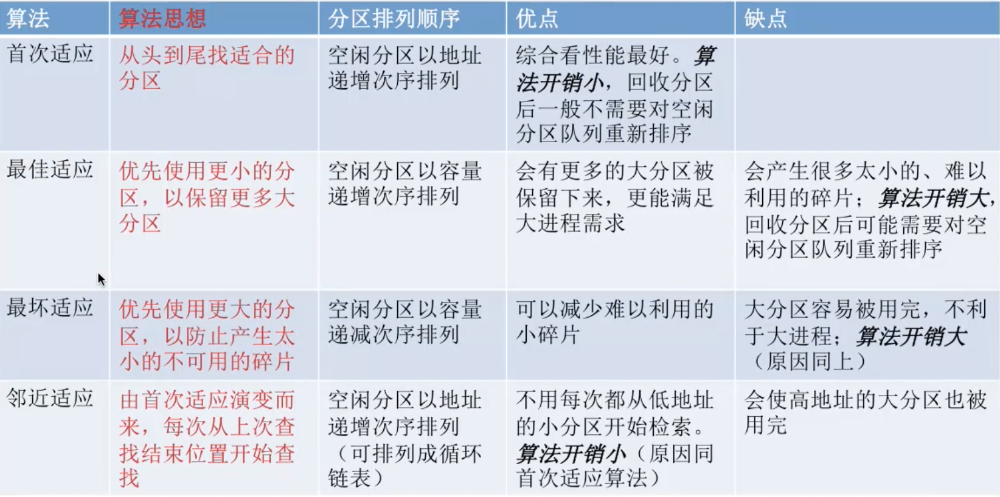

### 补充：计算内存堆、栈

**（1）静态（全局）存储区——static：**内存在程序编译的时候就已经分配好，这块内存在程序的整个运行期间都存在。它主要存放**静态数据、全局数据和常量**。也是程序结束后，由操作系统释放。
**（2）栈区——stack：**在执行函数时，**函数参数，局部变量（包括const局部变量），函数调用后返回的地址**都在栈上创建，函数执行结束时这些存储单元自动被释放。栈内存分配运算内置于处理器的指令集中，效率很高，但是分配的内存容量有限。
**（3）堆区——heap：**亦称***\*动态内存分配\****。程序在运行的时候用***\*malloc或new申请\****任意大小的内存，程序员自己负责在适当的时候用free或 delete释放内存。动态内存的生存期可以由我们决定，如果我们不释放内存，程序将在最后才释放掉动态内存。 但是，良好的编程习惯是：如果某动态内存不再使用，需要将其释放掉，否则，我们认为发生了内存泄漏现象。

分为七类：

**1.栈又叫堆栈，**非静态局部变量/函数参数/返回值等等 ，还有每次调用函数时保存的信息。每当调用一个函数时，返回到的地址和关于调用者环境的某些信息的地址，比如一些机器寄存器，就会被保存在栈中。然后，新调用的函数在栈上分配空间，用于自动和临时变量。

**2.内存映射段**是高效的I/O映射方式，用于装载一个共享的动态内存库。用户可使用系统接口创建共享共享内存，做进程间通信。

 **3.堆**用于程序运行时动态内存分配，堆是可以上增长的。堆区域从BSS段的末尾开始，并从那里逐渐增加到更大的地址。堆是由程序员自己分配的。堆区域由所有共享库和进程中动态加载的模块共享。

**4.数据段**分为初始化数据段和未初始化数据段。初始化的数据段，通常称为数据段，是程序的虚拟地址空间的一部分，它包含有程序员初始化的全局变量和静态变量，可以进一步划分为只读区域和读写区域。未初始化的数据段，通常称为bss段，这个段的数据在程序开始之前有内核初始化为0，包含所有初始化为0和没有显示初始化的全局变量和静态变量。

**5.代码段**也叫文本段，是对象文件或内存中程序的一部分，其中包含可执行代码和只读常量。文本段在堆栈的下面，是防止堆栈溢出覆盖它。，通常代码段是共享的，对于经常执行的程序，只有一个副本需要存储在内存中，代码段是只读的，以防止程序以外修改指令。

#### 非连续分配管理方式

##### 基本分页储存管理

把固定分区分配改造为非连续分配版本，把内存分为一个个相等的小分区，再按照分区大小把进程拆分为一个一个小的部分。

如果要采用分页储存，如何知道逻辑地址对应的物理地址？

如果一号页的起始逻辑地址是50-99，并且对应的内存地址是450，那么逻辑地址为80的内存单元应该在此页，并且相对于该页的起始地址而言，偏移量是30，那么实际物理地址=450+30=480

1. 算出逻辑地址对应的页号。
2. 要知道该页号对应页面在内存中的起始地址。
3. 要算出逻辑地址在页面内的偏移量是多少。
4. 物理地址=页面始址+偏移量

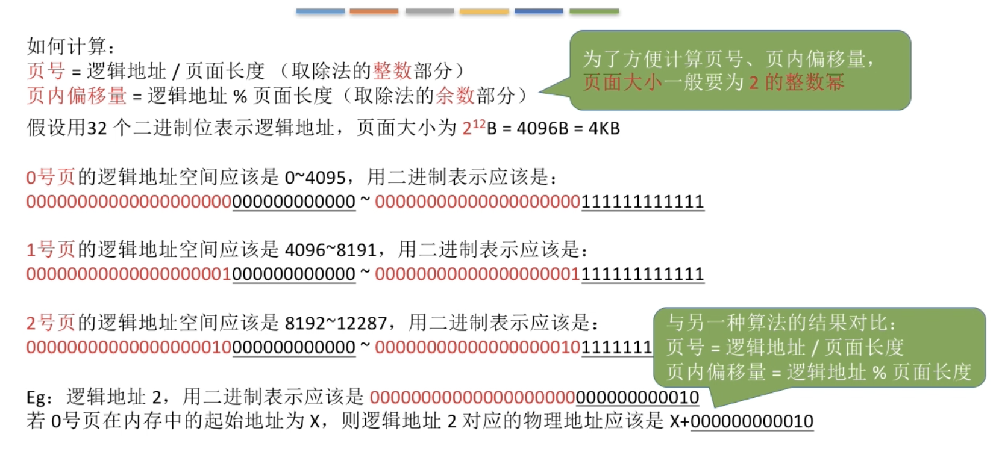

如果每个页面大小为2^k bits, 用二进制数表示逻辑地址，则末尾K位即为页内偏移量其余部分就是页号。

| 31 			... 				   12 | 11			...			0 |
| ---------------------------------------- | ------------------------------ |
| 页号P                                    | 页内偏移量                     |

如果有K位表示页内偏移量，则说明系统中一个页面的大小是2^k个内存单元。如果有M位表示页号，则说明在该系统中，一个进程中最多有2^M个页面。

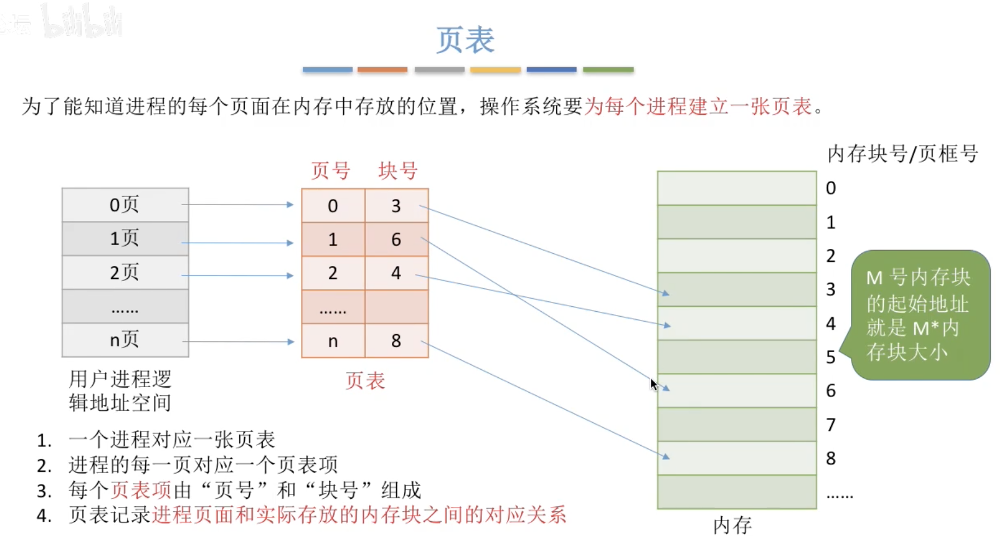

#### 地址变换机构

局部性原理

- 时间局部性：如果执行了程序中的某条指令，那么不久后这条指令很可能再次执行；如果某个数据被访问过，不久之后该数据很可能再次被访问
- 空间局部性：一旦程序访问了某个存储单元，在不久之后，其附近的存储单元也很有可能被访问。因为很多数据在内存中都是连续存放的

在基本地址变换机构中，每次要访问一个逻辑地址，都需要查询内存中的页表。忧郁局部性原理，可能连续很多次查到的都是同一个页表项。既然如此，可以用块表来利用局部性减少访问页表的次数。

##### 快表 TLB

又称联想寄存器（TLB），是一种访问速度比内存块很多的告诉缓冲存储器，用来存放当前访问的若干页表项，以加速地址变换的过程。与此对应，内存中的页表常称为慢表。

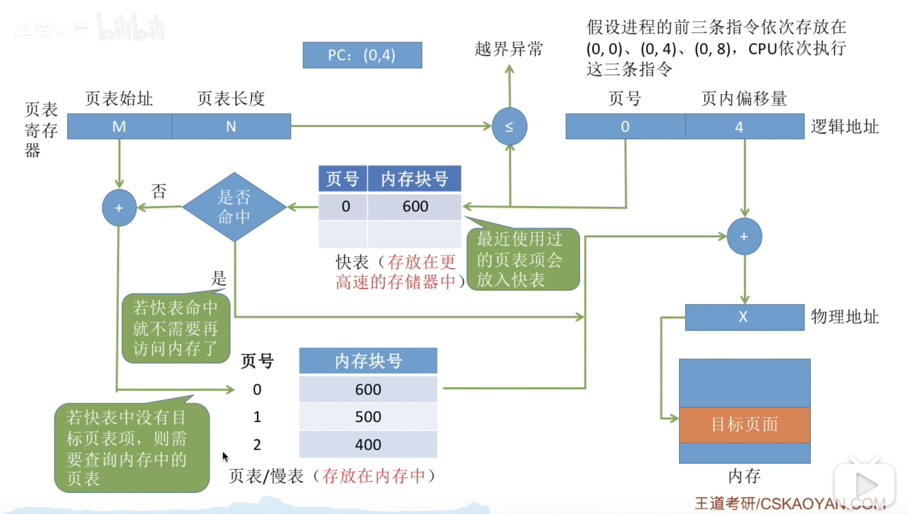

1. CPU给出逻辑地址，由某个硬件算得页号和页内偏移量，将页号与快表中所有页号进行比较。
2. 如果找到匹配页号，直接取出该页对应的内存块号。
3. 如果没有找到匹配页号，则需要访问内存中的页表，找到对应页表项，得到页面存放的内存块号，再将内存块号与页内偏移量拼接形成物理地址，最后，访问该物理地址对应的内存单元。

#### 两级页表

eg. 某计算机系统按字节寻址，支持32位逻辑地址，采用分页存储管理，页面大小为4KB，页表项长度为4B。

4KB = 2^12B，因此页内地址要用12位表示，剩余20位表示页号。

因此，该系统中用户进程最多有2^20页。相应的，一个进程的页表中，最多会有2^20=1M个页表项。

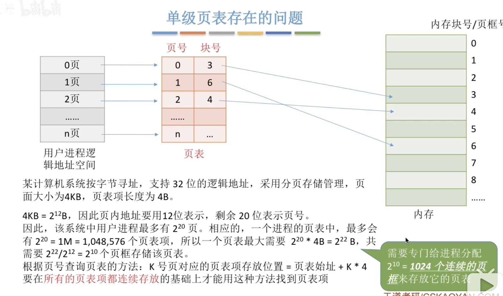

问题一：需要专门给进程分配2^20=1024个联系也狂来存放它的页表。**页表过大**

问题二：很多时候，进程在一段时间内只需要访问某几个页面就可以正常运行了。因为进程在一段时间内可能只需要访问某几个特定的页面。**无效页表**

按照开头的例子，页面大小4KB，每个页表项4B，每个页面可存放1K个页表项，因此每1K个连续的页表项为一组，每组刚好站一个内存块，再将各组离散地放到各个内存块中。另外，腰围离散分配的页表再建立一张页表，称为*页目录表*，或称*外层页表*，或称*顶层页表*。

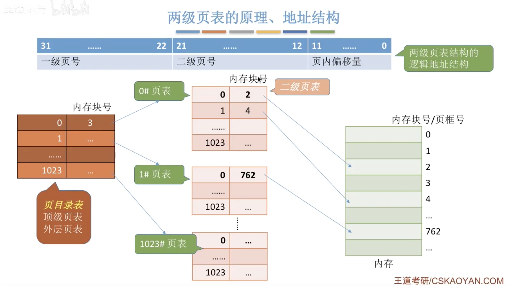

相应地，逻辑地址的结构也要发生变化。

| 31 			... 				   22 | 21			...			12 | 11			...			0 |
| ---------------------------------------- | ------------------------------- | ------------------------------ |
| 一级页号                                 | 二级页号                        | 页内偏移量                     |

#### 基本分段存储管理方式

进程的地址空间：按照程序自身的逻辑关系划分为若干个段，每个段都有一个段名（在低级语言中，程序员使用短命来编程），每段以0开始编址。

内存分配规则：以段位单位进行分配，每个段在内存中占据连续空间，但各段之间可以不相邻。

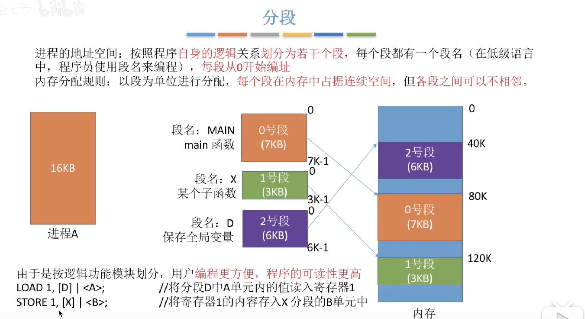

**程序会将段名转换成段号**

| 31			.... 		16 | 15			....			0 |
| ----------------------------- | ------------------------------- |
| 短号                          | 段内地址                        |

若系统是按字节寻址的，段号占16位，因此在该系统中，每个进程最多有2^16=64K个段。段内地址占16位，因此每个段最爱的长度是2^16=64KB。

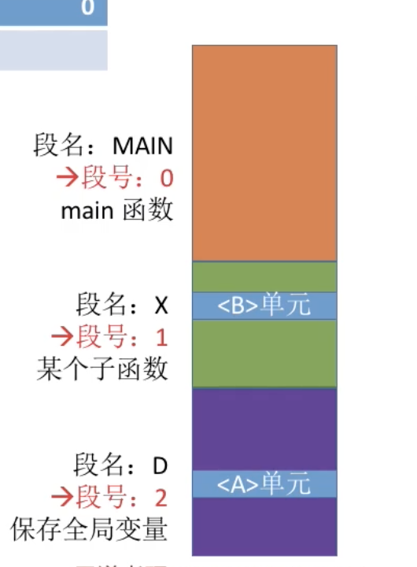

段表：

程序分为多个段，各段离散地装入内存，为了保证程序能正常运行，就必须能从屋里内存中找到各个逻辑段存放位置。为此，需为每个进程建立一张段映射表，简称”段表“。

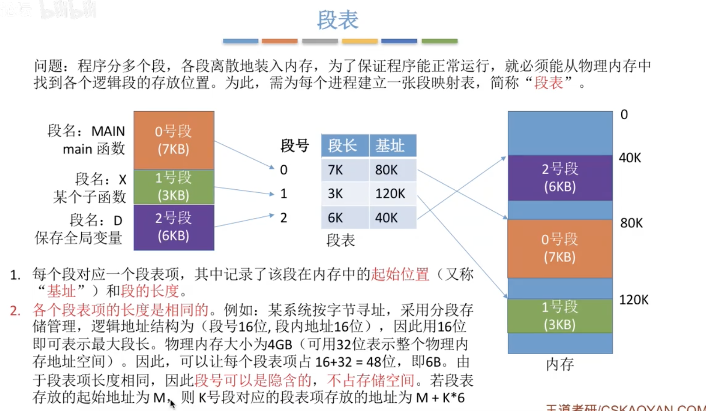

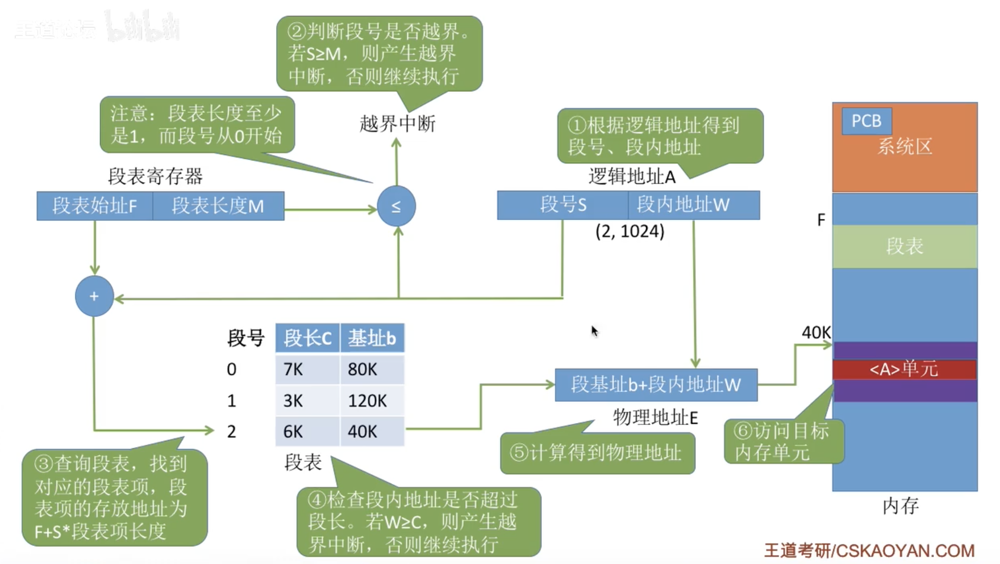

分页、分段管理的对比

页是信息的物理单位。分页的主要目的是为了实现离散分配，提高内存利用率。分页仅仅是系统管理上的需要，完全是系统欣慰，对用户是不可见的。

页的大小固定且由系统决定。

分页的用户进程地址空间是一维的，程序员只需要给出一个记忆符即可表示一个地址。

段是信息的逻辑单位。分段的主要目的是为了更好地满足用户需求。一个段通常包含着一个组属于一个逻辑模块的信息。分段对用户是可见的，用户编程时需要显式的给出段名。

段的长度不固定，却绝与用户编写的程序。

分段的用户进程地址空间是二位的，程序员在表示一个地址时，既要给出段名，也要给出段内地址。

**分段比分页更容易实现信息的共享和保护**

如果有一个段需要被多个进程共享的话，可以在这两个进程的段表里存储相应的段表项，然后共享地访问段内数据。如果是分页的话，如果两个进程共享同一个段，而这个段很可能不在同一页里。不方便标记是否能被其他进程访问。

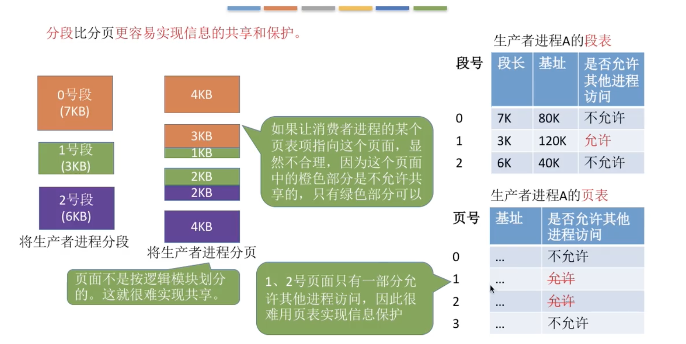

#### 段页式管理方式

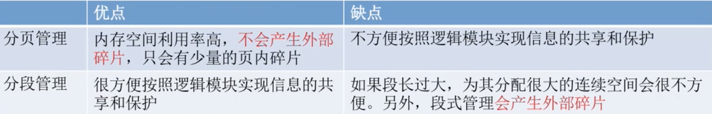

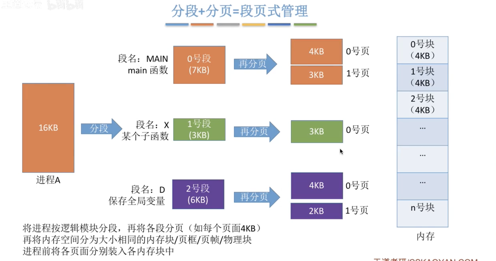

段页式系统的逻辑地址结构由段号、页号、页内地址（页内偏移量）组成：

| 31		...		16 | 15	...	12 | 11		...		0 |
| ----------------------- | --------------- | ---------------------- |
| 段号                    | 页号            | 页内偏移量             |

段号占16位，每个进程最多有2^16=64K个段；页号占4位，因此每个段最毒哦呦2^16页；页内偏移量占12位，因此每个页面\每个内存块大小为2^12=4096=4KB。

通过段号找到段表项，可以得到页表长度、页表项存放快好（页表其实地址），然后通过访问页表的存放位置得到具体的物理地址。

## 虚拟内存

也是一种内存空间扩充的技术（覆盖技术、交换技术）

**高速缓冲技术**：将近期会频繁访问到的数据放到更高速的存储器中，暂时用不到的数据放在更低速的存储器中。

**虚拟内存的定义和特征**

基于局部性原理，在程序装入时，可以将程序中很快会用到的部分装入内存，暂时用不到的部分留在外存，就可以让程序开始执行。

在程序执行过程中，当所访问的信息不在内存时，由操作系统负责将所需信息从外存调入内存，然后继续执行程序。

若内存空间不够，由操作系统负责将内存中暂时用不到的信息换出外存。在操作系统的管理下，在用户看来似乎有一个比实际内存大得多的内存，这就是**虚拟内存**。

操作系统需要负责调入调出页，为了实现"请求调页"，**操作系统需要知道每个页面是否已经调入内存**；如果还没有调入，**那么也需要知道该页面在外存中存放的位置**。

当内存空间不够时，要实现“页面置换”，操作系统需要通过某些指标来**决定到底换出哪个页面**；有些页面没有被修改过，就不用再浪费时间写回外存。有的页面被修改过，就需要将外存中的旧数据覆盖，**因此操作系统也需要记录每个页面是否被修改过的信息**。

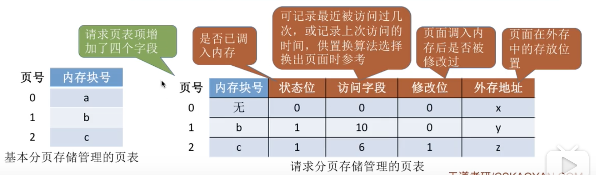

**地址变换机构**

请求分页存储管理与基本分页存储管理的主要区别是：

请求分页新增步骤: 请求调页（查到页表项时进行判断），页面置换（需要调入页面，但没有空闲内存块时进行），需要修改请求夜班表中新增的表项。

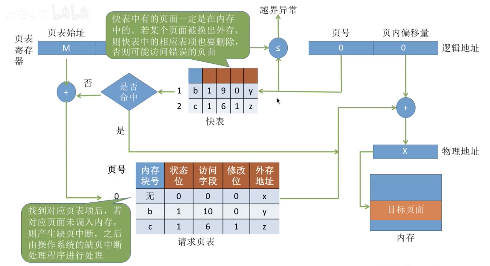
